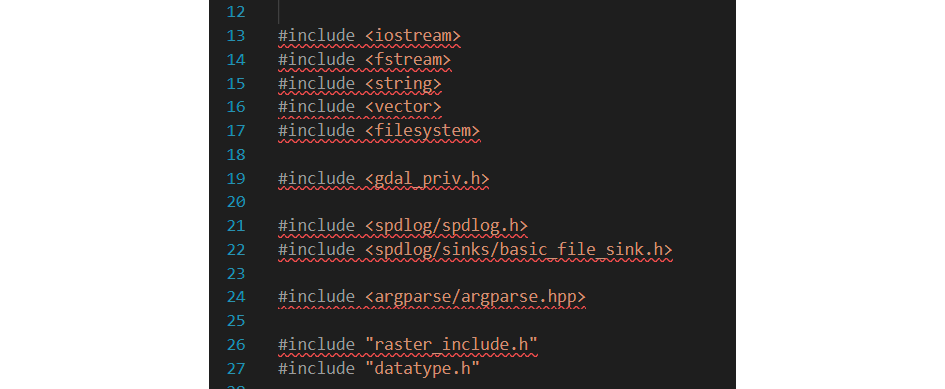

昨天（2024-05-08）下午开始，VSCode智能提示突然罢工，

起初是认为MSVC编译器更新导致includepath更换导致“无法找到 源 文件”，于是便开始疯狂在settings.json和c_cpp_properties.json中添加信息

settings.json:

- C_Cpp.errorSquiggles: enabled
- C_Cpp.intelliSenseEngineFallback: enabled
- C_Cpp.default.compilerPath: vs2022/community/vc/tools/msvc/14.39.33519/bin/hostx64/x64/cl.exe
- C_Cpp.default.includePath: vs2022/community/vc/tools/msvc/14.39.33519/include
- ...

json和c_cpp_properties.json:

- compilerPath" vs2022/community/vc/tools/msvc/14.39.33519/bin/hostx64/x64/cl.exe
- intelliSenseMode: msvc-x64,
- configurationProvider: ms-vscode.cmake-tools,
- windowsSdkVersion: 10.0.19041.0
- ...

自己能想到的，网上能搜到的搜试了一遍，都无济于事，直到尽早偶然发现VSCode的C/C++插件（负责cpp_intelliSense）最近一次更新是21小时前，与罢工相吻合，于是便退回了一个版本，重启VSCode后一切恢复正常...

