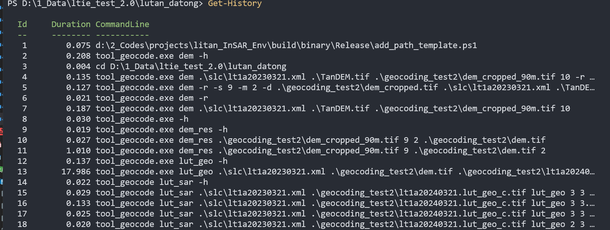
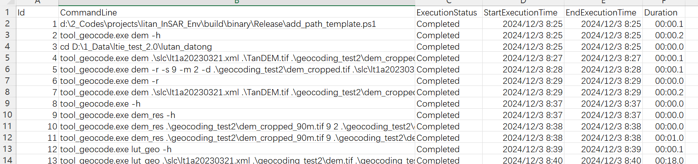

## 1.在控制台查看历史指令

使用该指令可以在控制台打印当前窗口的历史指令，但当指令超过控制台宽度时，指令会被省略号代替

```powershell
Get-History
```



## 2.保存指令

将指令输出到csv文件中，保留完整的指令，以及每条指令的启动与终止时间、耗时等信息。

```powershell
Get-History | Export-Csv -Path tool_geocode_history.csv
```



<!-- truncate -->