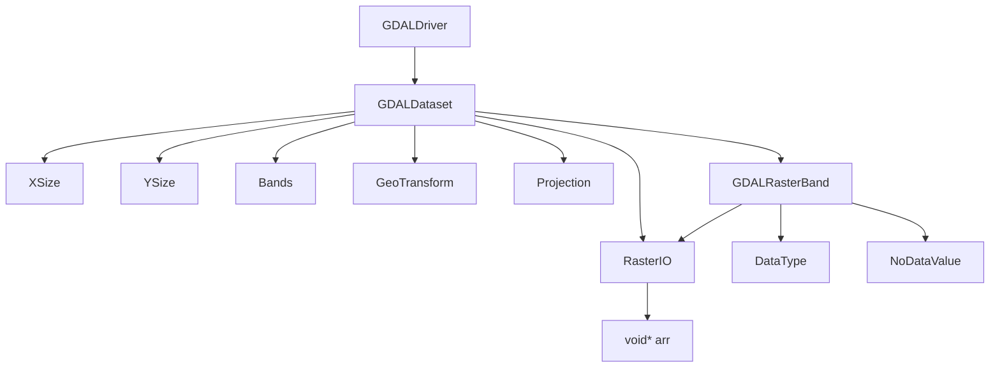
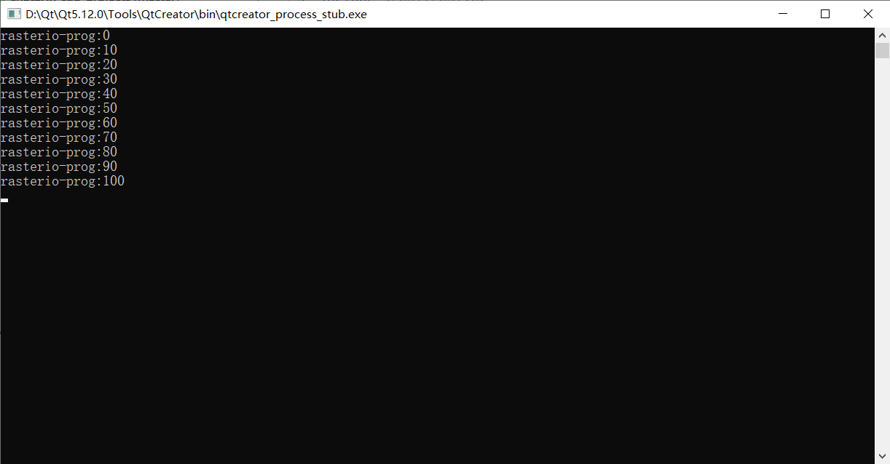
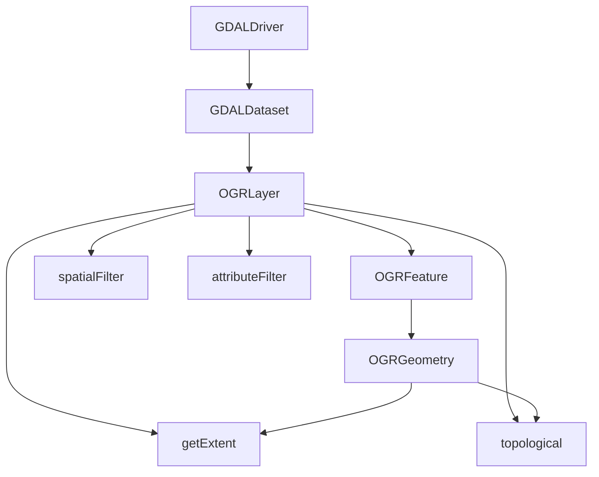

# GDAL

地学常用的图像处理库

代码可参考github库:[gdal_exes](https://github.com/li-tann/execs_dependent_on_gdal), 一些根据实际需求写的小函数。

## 栅格数据处理

### 栅格基础数据类型



### Create, Read, Write

使用GDALOpen()读取影像信息存储至GDALDataset，有GA_ReadOnly和GA_Update两种方式，顾名思义。

```cpp
int image_read(const char* imgpath)
{
    /// 加载所有注册器
    GDALAllRegister();
    /// 是否支持读取utf8路径
    CPLSetConfigOption("GDAL_FILENAME_IS_UTF8", "NO");

    /// 读取文件到
    GDALDataset* p_src_ds =  (GDALDataset*)GDALOpen(imgpath, GA_Update);

    if(p_src_ds == nullptr){
        return -1;
    }

    int width = p_src_ds->GetRasterYSize();
    int height= p_src_ds->GetRasterXSize();
    int bands = p_src_ds->GetRasterCount();
    GDALDataType type = p_src_ds.GetRasterBand(1).GetRasterDataType();

    if(type != GDT_FLOAT32)
        return false;

    /// 指波段的读取顺序
    int panBandMap[3] = { 1,2,3 };

    /// 创建驱动
    GDALDriver* p_dst_driver = GetGDALDriverManager()->GetDriverByName("GTiff");
    /// 通过驱动创建数据层
    GDALDataset* p_dst_ds = p_dst_driver->Create("./output.tif",width,height,bands,GDT_Float32,nullptr);

    CPLErr cpl_err;
    cpl_err = p_src_ds->RasterIO(GF_Read,0,0,img_width,img_height,c_float_arr,img_width,img_height,GDT_CFloat32,1,panBandMap,0,0,0);
    for(int band = 1; band <= bands; band++)
    {
        for(int row = 0; row < height; row++)
        {
            /// 以float格式逐行读取数据
            float* p_flt_arr = new float[size_t(width)];
            cpl_err = p_src_ds->RasterIO(GF_Read,0,row,width,1,p_flt_arr,width,1,GDT_Float32,band,panBandMap,0,0,0);
            if(cpl_err == CE_Failure){
                GDALClose(p_src_ds);
                GDALClose(p_dst_ds);
                delete[] p_flt_arr;
                return false;
            }
            /// 处理数据
            for(int col=0; col < width; col++)
            {
                p_flt_arr[j] += 1;
            }
            /// 需要注意, 只有当GDALDataset是通过Create创建、或GDALOpen("",GA_Update)时，才可以执行写入操作
            cpl_err = p_dst_ds->RasterIO(GF_Write,0,row,width,1,p_flt_arr,width,1,GDT_Float32,band,panBandMap,0,0,0);
            if(cpl_err == CE_Failure){
                GDALClose(p_src_ds);
                GDALClose(p_dst_ds);
                delete[] p_flt_arr;
                return false;
            }
            delete[] p_flt_arr;
        }
    }

    GDALClose(p_src_ds);
    GDALClose(p_dst_ds);
}
```

### MEM数据格式

当代码需要使用GDAL频繁的创建临时数据并且无需输出时，将数据写到磁盘中，频繁的读写操作会降低代码的运行效率、并且大量的临时数据写入到磁盘中最后再被删除，长期积累也会对硬盘造成一定影响。

所以，需要使用GDAL提供的MEM数据格式，将生成的数据（GDALDataset格式）保存到内存中，既可以方便数据的读取、又能够减少硬盘的损耗，唯一的确定就是对内存要求更高。

GDAL的数据读取是使用GDALOpen等函数读写数据时，都需要输入数据的地址const char*  pszFilename`，使用GDAL提供的MEM数据存储格式，即可解决该问题。

使用gdal自带的gdalwarp对数据进行开窗、重采样处理，由于代码只支持整景影像的重采样，所以需要使用RasterIO(..)提取出窗口数据，保存在内存中，再传入gdalWarp进行重采样处理。

```cpp
//代码回头在写...
GDALDataset* pSrcDS = (GDALDataset*)GDALOpen(pszSrcFile,GA_ReadOnly);
if(pSrcDS == nullptr){
    return -1;  //Error -1, "srcDataset's point is equal with nullptr
}
GDALDataType eDT = pSrcDS->GetRasterBand(1)->GetRasterDataType();
int iBandCount = pSrcDS->GetRasterCount();
int iSrcWidth = pSrcDS->GetRasterXSize();
int iSrcHeight = pSrcDS->GetRasterYSize();
void* arr;
//读取窗口数据
CPLErr e_cpl = pSrcDS->RasterIO(GF_Read, 0, 0, iSrcWidth, iSrcHeight, arr, iSrcWidth, iSrcHeight, GDT_Float64, iBandCount, ibands, 0, 0, 0);
sprintf_s(c_src_mem_path, 256, "MEM:::DATAPOINTER=%d,PIXELS=%d,LINES=%d,BANDS=%d,DATATYPE=%s", arr, iSrcWidth, iSrcHeight, iBandCount, GDALGetDataTypeName(eDT));
```

核心是MEM数据的写法，如下所示：

```cpp
sprintf_s(c_src_mem_path, 256, "MEM:::DATAPOINTER=%d,PIXELS=%d,LINES=%d,BANDS=%d,DATATYPE=%s", arr, iSrcWidth, iSrcHeight, iBandCount, GDALGetDataTypeName(eDT));
```

### setProjection

为影像添加坐标系统

参考网址：[4326坐标系统字符串格式](https://spatialreference.org/ref/epsg/4326/html/)

```cpp
/// 此处为了整齐 切了很多行, 实际使用时会报错，需要将所有字符修改到同一行中。
const char* projection = "GEOGCS[\"WGS 84\",
    DATUM[\"WGS_1984\",
        SPHEROID[\"WGS 84\",6378137,298.257223563,
            AUTHORITY[\"EPSG\",\"7030\"]],
        AUTHORITY[\"EPSG","6326\"]],
    PRIMEM[\"Greenwich\",0,
        AUTHORITY[\"EPSG","8901\"]],
    UNIT[\"degree\",0.01745329251994328,
        AUTHORITY[\"EPSG","9122\"]],
AUTHORITY[\"EPSG","4326\"]]";

GDALDataset::setProjection(projection);
```

### GDAL进度条

gdal的进度条都是通过回调函数使用的。

使用方法为：

1. 根据三个形参（实际上只使用了第一个参数），编写一个返回值为int的函数，函数内使用形参输出相应的进程信息。

2. 把这个函数指针写入gdal的函数的指定位置完成。

以RasterIO为例：

首先写进度值返回函数：

```cpp
int gdalprocess_tmp(double dfComplete,char * pszMessage,void * pProgressArg)
{
    int prog = static_cast<int>(dfComplete * 10);
    static int last_prog = -1;
    if(prog < last_prog){
        last_prog = -1;
    }
    if(last_prog < prog){
        printf("rasterio-prog:%d\n",prog * 10);
        last_prog = prog;
    }
    return true;
}
```

函数的输出格式为：每过10输出一次当前进度。

main：

```cpp
#include <gdal/gdal_priv.h>
#include <gdal/gdal.h>

int main(int argc, char *argv[])
{
    GDALAllRegister();
    GDALDataset* pdataset = (GDALDataset*)GDALOpen("...",GA_ReadOnly);
    float* arr = new float[pdataset->GetRasterXSize() * pdataset->GetRasterYSize()];
    //定义GDALRasterIOExtraArg并初始化（初始化函数需要gdal.h）
    GDALRasterIOExtraArg ex_arg;
    INIT_RASTERIO_EXTRA_ARG(ex_arg);
    //这个是上面自己写的读进度值函数
    ex_arg.pfnProgress = (GDALProgressFunc)gdalprocess_tmp;
    //这个是gdal自带的读进度值函数，每过2.5%输出一个“.”，每过10%输出一次数字
//    ex_arg.pfnProgress = (GDALProgressFunc)GDALTermProgress;

    pdataset->GetRasterBand(1)->RasterIO(GF_Read, 0, 0, pdataset->GetRasterXSize(), pdataset->GetRasterYSize(), arr, pdataset->GetRasterXSize(), pdataset->GetRasterYSize(), GDT_Float32, 0, 0, &ex_arg);
    
    return 1;
}
```

结果如图所示



## 矢量数据处理

### 矢量基础数据类型



了解较少，后续学习过程中会逐渐完善

### 拓扑关系

OGR中提供的拓扑关系有七种，函数格式相似, 形如，

```cpp
OGRLyaer::Topological(OGRLayer* pLayerMehtod,.....)
///将当前图层记为 lyrC, 给定图层记为lyrM。
///（lyr: layer, C: current, M: method）
```

- intersection，求lyrC与lyrM两个图层的交集
- union，求lyrC与lyrM两个图层的并集
- symdifference，求lyrC与lyrM两个图层的对称差
- identity，用lyrM的要素识别lyrC的要素，图层求交，属性表求并
- update，将给定layer更新到当前layer中
- clip，用lyrM裁剪lyrC，
- crase，擦除lyrC被lyrM覆盖的区域


如果只需要计算几何关系，不考虑属性表的话，intersetion，union和symDifference应该是三种最常用的拓扑关系。

### CreateLayer, wkbPolygon

由点信息生成多边形shp

```cpp
vector<xy> points; /// 存储了大量的点信息

OGRPolygon* polygen = (OGRPolygon*)OGRGeometryFactory::createGeometry(wkbPolygon);
OGRLinearRing* ring = (OGRLinearRing*)OGRGeometryFactory::createGeometry(wkbLinearRing);
OGRPoint point;

for(auto& iter : points)
{
    point.setX(iter.x); point.setY(iter.y);
    ring->addPoint(&point);
}
/// 在终点后再添加一次起点, 形成闭环
point.setX(points[0].x); point.setY(points[0].y);
ring->addPoint(&point);

ring->closeRings();
polygen->addRing(ring);
```

### 由Geometry生成shp文件

以上面的polygon为例，

```cpp
GDALDriver* shp_driver = GetGDALDriverManager()->GetDriverByName("ESRI Shapefile");
if (shp_driver == nullptr) {
    return message(false, "shp driver is nullptr.");
}

/// 新版的GDAL 已经弃用了早期的OGRDataResouce, 改用GDALDataset, Create这种同一的函数
GDALDataset* ds = shp_driver->Create(shp_file, 0, 0, 0, GDT_Unknown, NULL);
if (ds == nullptr) {
    return message(false, "ds is nullptr.");
}

/// 设置坐标系统
OGRSpatialReference spatialRef;
spatialRef.SetWellKnownGeogCS("WGS84");
OGRLayer* layer = ds->CreateLayer("layer", &spatialRef, wkbPolygon, NULL);
if (layer == nullptr) {
    return message(false, "layer is nullptr.");
}

OGRFeatureDefn* featureDefn = layer->GetLayerDefn();
OGRFeature* feature = OGRFeature::CreateFeature(featureDefn);
OGRErr err = feature->SetGeometry((OGRGeometry*)polygen);
if (err != OGRERR_NONE) {
    if (err == OGRERR_UNSUPPORTED_GEOMETRY_TYPE) {
        return message(false, "unsupported geometry type.");
    }
    else{
        return message(false, "unknown setGeometry error.");
    }
}


if (layer->CreateFeature(feature) != OGRERR_NONE) {
    return message(false, "create feature in shapefile failed.");
}


OGRFeature::DestroyFeature(feature);
GDALClose(ds);
```
