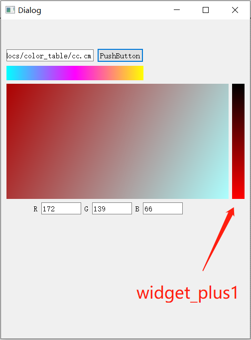
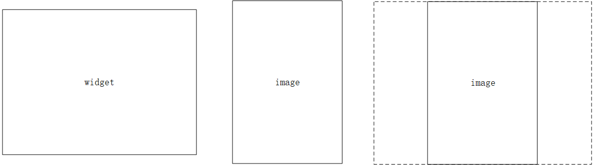
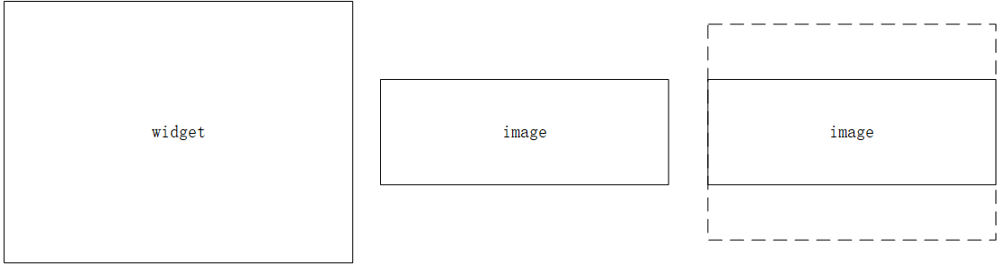

# widget控件的常用事件

Qt Widget控件的拖拽、绘制等事件

## paintEvent绘图事件

paintEvent(QPaintEvent *event) 主要用于图形的绘制，当设置布局（layout）后，改变窗口尺寸会触发update/repaint？事件，重新对QWidget进行绘制

使用方法：

以**渐变色条**为例，

创建一个“plus”版的widget控件，重载paintEvent事件，不关注`mousePressEvent`

```cpp
//// .h
class widget_plus1 : public QWidget
{
    Q_OBJECT
public:
    explicit widget_plus1(QWidget *parent = nullptr);
    ~widget_plus1();

    int widget_plus1_num;

protected:
    void paintEvent(QPaintEvent* event);
    void mousePressEvent(QMouseEvent* event);

signals:
    void mousePressed();

};
```

函数的定义：

```cpp
/// .cpp 
widget_plus1::widget_plus1(QWidget *parent):QWidget(parent){}

widget_plus1::~widget_plus1(){}

void widget_plus1::paintEvent(QPaintEvent *event)
{
    QPainter painter(this);
    painter.setRenderHint(QPainter::Antialiasing,true);
    /// 规定线性梯度的样式, 此处线性变形规定起点为(0,0) 终点为(0,height) , 目的是线性变形与横坐标无关, 即水平方向的颜色显示相同
    QLinearGradient Linear(0,0,0,this->height());   
    /// 设置起止点的颜色
    Linear.setColorAt(0,QColor(0,0,0));
    Linear.setColorAt(1,QColor(255,0,0));
    /// 将笔刷设置为刚才设置好的线性梯度变化样式 Linear
    painter.setBrush(Linear);
    painter.setPen(Qt::transparent);
    /// 规定painter的绘画区域, 此处自由设置, 示例中希望绘制区域与窗口尺寸相同
    painter.drawRect(0,0,this->width(),this->height());         
    Q_UNUSED(event);
}

void widget_plus1::mousePressEvent(QMouseEvent *event)
{
    QPoint mouse = event->pos();
    widget_plus1_num = mouse.y() * 255 / this->height();
    emit mousePressed();
}
```

结果展示：



paintEvent 绘图事件,  在窗体显示影像时使用率非常高

## dragEnterEvent dropEvent 拖拽事件

实现拖动数据进度该组件并进行处理的情况

dropEnterEvent的官方说明:

This event handler is called when a drag is in progress and the mouse enters this widget. The event is passed in the event parameter.
If the event is ignored, the widget won't receive any drag move events.

当拖动过程中鼠标进入此小部件时，将调用此事件处理程序。事件在事件参数中传递。

如果忽略该事件，小部件将不会收到任何拖动事件。

dropEvent的官方说明:

This event handler is called when the drag is dropped on this widget. The event is passed in the event parameter.

当拖放到此小部件上时，将调用此事件处理程序。事件在事件参数中传递。

[该功能很重要但未来得及测试和学习，故先放链接，待后续学习和使用后再详细说明心得](https://blog.csdn.net/xiaolong1126626497/article/details/114024762)

也可以再QtCreator的帮助中搜索“Drag and Drop”查看文档学习。

## paintEvent_version2

（其中以说明思路为主配有部分代码段，但可能不完整，不保证代码复制粘贴后可直接使用。思路清晰后写代码并不困难）

（代码中使用qimage直接读取其可识别的文件格式，如果读遥感影像，则需要自己完善前面相应的步骤）

使用paintEvent打印图像到widget中，并且通过指针显示影像坐标（像平面坐标）

下面代码如果没有特殊标注，全都是void paintEvent(QPaintEvent* event){...}槽函数中的代码。

### 1.影像的初始化显示

基本思想是将image填充到widget的窗口中，代码为：

```cpp
QPainter painter;
QImage image = QImage(....);
QRectF target = QRectF(0, 0, this->width(), this->height());
QRectF source = QRectF(...);
painter.drawImage(target, image, source);
```

将在`source`范围的`image`图像打印到widget控件的`target`范围内。

source的确定：

由于影像与窗口的长宽比例不同，直接将整景影像打印到窗口中会出现横向或纵向的拉伸效果。**错误**代码如下：

```cpp
QPainter painter;
QImage image = QImage(....);
QRectF target = QRectF(0, 0, this->width(), this->height());
QRectF source = QRectF(0, 0, image.width(), image.height());
painter.drawImage(target, image, source);
```

需要确定影像与窗口各自的高宽比（或宽高比均可），根据情况将影像缩放至适当比例，并选择正确的成像范围`source`。

以高宽比为例，$r_{\frac{h}{w}} = height / width$

若影像高宽比大于窗口高宽比，说明影像比例纵向更长；需要以影像的高为基准，计算影像需要显示在窗口的宽度，如下图所示：


若影像高宽比小于窗口高宽比，说明影像比例横向更长；需要以影像的宽为基准，计算影像需要显示在窗口的高度，如下图所示：


```cpp
double image_h_w_rate = image.height() / image.width();
double widget_h_w_rate = this->height() / this->width();
QSizeF source_size;
if(image_h_w_rate > widget_h_w_rate)
{
    source_size = QSizeF(image.height() / widget_h_w_rate,image.height());
}else
{
    source_size = QSizeF(image.width() ,image.width() * widget_h_w_rate);
}

QRectF source = QRectF(QPointF(0,0),source_size);
painter.drawImage(target, image, source);
```

此时，影像可以正确的比例显示在widget中，但显示区域是以左上角为起点，并不居中。

如果想要居中显示，需要建立影像`image`和窗口`widget`之间的关联，需要引入参数影像窗口比，即影像尺寸与窗口尺寸之间的比例关系，$r_{\frac{img}{wgt}} = image.size / widget.size$

此处使用的image.size是经过上一步改变比例后的image，比例与widget相同。

```cpp
QSizeF source_size;
double rate_image_divide_widget;
if(image_h_w_rate > widget_h_w_rate)
{
    source_size = QSizeF(image.height() / widget_h_w_rate,image.height());
    rate_image_divide_widget = image.height() * rate_wheel / target.height();
}else
{
    source_size = QSizeF(image.width() ,image.width() * widget_h_w_rate);
    rate_image_divide_widget = image.width() * rate_wheel / target.width();
}
```

确定影像与窗口的比例关系后，影像需要移动的长度为：

如果影像高宽比大于窗口高宽比，需要将影像显示范围向左移动：窗口宽度换算为影像尺寸的宽度后，与影像宽度相减除以2的距离，即为将影像在中心显示时，影像显示区域起点的坐标。

同理，如果影像高宽比小于窗口高宽比，需要将影像显示范围向上移动：窗口高度换算为影像尺寸的高度后，与影像高度相减除以2的距离，即为将影像在中心显示时，影像显示区域起点的坐标。代码如下：

```cpp
if(image_h_w_rate > widget_h_w_rate)
    source = QRectF(QPointF(-(this->width() * rate_image_divide_widget - image.width())/2,0),source_size);
else
    source = QRectF(QPointF(0,-(this->height() * rate_image_divide_widget - image.height())/2 ),source_size);
```

综上，影像以正常比例，居中显示在窗口的代码为：

```cpp
QPainter painter;
QImage image = QImage(....);
QRectF target = QRectF(0, 0, this->width(), this->height());
QRectF source = QRectF(...);

image_h_w_rate = image.height() * 1.0 / image.width();
widget_h_w_rate = this->height() * 1.0 / this->width();

if(image_h_w_rate > widget_h_w_rate){
    source_size = QSizeF(image.height() / widget_h_w_rate * rate_wheel,image.height() * rate_wheel);
    rate_image_divide_widget_new = image.height() * rate_wheel / target.height();
}else{
    source_size = QSizeF(image.width() * rate_wheel,image.width() * widget_h_w_rate * rate_wheel);
    rate_image_divide_widget_new = image.width() * rate_wheel / target.width();
}

if(image_h_w_rate > widget_h_w_rate)
    source = QRectF(QPointF(-(this->width() * rate_image_divide_widget_new - image.width())/2,0),source_size);
else
    source = QRectF(QPointF(0,-(this->height() * rate_image_divide_widget_new - image.height())/2 ),source_size);

painter.drawImage(target, image, source);
```

### 2.影像的缩放

缩放问题需要分解为两部分：

1. 设置一个缩放系数`rate_wheel`，根据缩放系数修改影像显示区域`source`，重新绘制影像；
2. 确定缩放点，缩放时需要以鼠标为中心对影像进行缩放处理。

缩放系数的确定相对比较容易，以鼠标为中心点缩放的思路为：

1. 获取鼠标在窗口的坐标（等价于鼠标到窗口(0,0)点的坐标）
2. 使用缩放前的缩放系数和影像窗口比换算成鼠标在影像中的坐标；
3. 缩放系数改变后，鼠标在窗口和影像中的坐标不应该发生变化；
4. 缩放系数改变后，需要修改影像显示区域的起点坐标；
5. 已知缩放前鼠标在影像中的坐标，又可以通过缩放后鼠标距离窗口起始点的坐标换算得到鼠标距离影像起始点的距离，从而计算得到所房后的影像起始点坐标。

代码如下：

```cpp
QPointF cursor_widget = this->mapFromGlobal(cursor().pos());
QPointF cursor_image  = source.topLeft() + cursor_widget * rate_image_divide_widget;
QPointF source_topLeft_new = cursor_image - cursor_widget * rate_image_divide_widget_new;
source = QRectF(source_topLeft_new,source_size);
rate_image_divide_widget = rate_image_divide_widget_new;
```

当缩放系数改变时，同样需要修改影像的显示尺寸`source_size`

```cpp
if(image_h_w_rate > widget_h_w_rate){
    source_size = QSizeF(image.height() / widget_h_w_rate * rate_wheel,image.height() * rate_wheel);
    rate_image_divide_widget_new = image.height() * rate_wheel / target.height();
}else{
    source_size = QSizeF(image.width() * rate_wheel,image.width() * widget_h_w_rate * rate_wheel);
    rate_image_divide_widget_new = image.width() * rate_wheel / target.width();
}
```

综上，支持影像正常成像和缩放的代码如下所示：

```cpp
QPainter painter(this);

if(image_h_w_rate > widget_h_w_rate){
    source_size = QSizeF(image.height() / widget_h_w_rate * rate_wheel,image.height() * rate_wheel);
    rate_image_divide_widget_new = image.height() * rate_wheel / target.height();
}else{
    source_size = QSizeF(image.width() * rate_wheel,image.width() * widget_h_w_rate * rate_wheel);
    rate_image_divide_widget_new = image.width() * rate_wheel / target.width();
    }

if(rate_wheel >= 1)
{
    // 居中显示
    if(image_h_w_rate > widget_h_w_rate)
        source = QRectF(QPointF(-(this->width() * rate_image_divide_widget_new - image.width())/2,0),source_size);
    else
        source = QRectF(QPointF(0,-(this->height() * rate_image_divide_widget_new - image.height())/2 ),source_size);

    rate_image_divide_widget = rate_image_divide_widget_new;
}
else
{
    /// equal to get_cursor_in_image()
    QPointF cursor_widget = this->mapFromGlobal(cursor().pos());
    QPointF cursor_image  = source.topLeft() + cursor_widget * rate_image_divide_widget;
    QPointF source_topLeft_new = cursor_image - cursor_widget * rate_image_divide_widget_new;
    source = QRectF(source_topLeft_new,source_size);
    rate_image_divide_widget = rate_image_divide_widget_new;
}

painter.drawImage(target,image,source);
```

### todo：影像拖拽移动

有时间再继续补充
