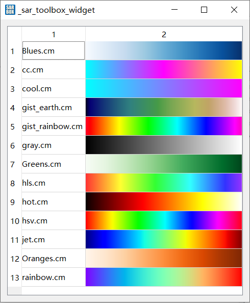

# TableWidget

TabWidget一些使用方法

## setCellWidget存放QWidget

QTableWidget可以**存放QWidget**，以**颜色表展示**窗口为例。

通过很多前缀操作，得到一个绘制颜色表信息的QWidget的子类“linear_garadient_wgt”, 需要在tablewidget中展示这些颜色表信息。

代码如下：

```C++
/// 展示界面的构造函数
///“colortable_display_wgt::colortable_display_wgt(QWidget *parent) : QWidget(parent)”中
///(考虑到之后可能是一个子模块，所以没有用QDialog, 而是QWidget)

table_widget = new QTableWidget(this);
table_widget->setColumnCount(2);
/// .... 生成颜色表linear_garadient_wgt的中间过程
table_widget->setRowCount(colortable_path.size());

int i=0;
for(auto iter: colortable_path)
{
    linear_gradient_wgt* wgt = new linear_gradient_wgt(table_widget);
    QMap<double,QColor> map = wgt->read_cm_file(iter);
    wgt->get_colormap(map);
    QLabel *label = new QLabel(table_widget);
    label->setText(QFileInfo(iter).fileName());
    /// 向表格中添加QWidget
    table_widget->setCellWidget(i,0,label);
    table_widget->setCellWidget(i,1,wgt);
    i++;
}

```

显示效果如下：



## 表格属性设置

QTableWidget 的设置大部分和cell相关，而关于表格属性值的设置则是继承自QTableView，常用的属性有:

设置表格的宽高 setColumnWidth()  setRowHeight()

设置文字换行策略 setWordWrap(bool on)

|属性设置           |代码                               |
| :--------------: | :-------------------------------: |
|设置表格表头信息   |horizontalHeader()->...            |
|设置表格表头信息   |verticalHeader()->...              |
|设置表格的宽       |setColumnWidth(int col, int width) |
|设置表格的宽       |setColumnWidth(int col, int width) |
|设置表格的高       |setRowHeight(int row, int height)  |
|设置文字换行策略   |setWordWrap(bool on)               |
|...                |...                               |

## 单击双击事件区分

以QTreeWidget为例, 但也包含QTreeView、QTableWidget等控件, 都会出现该问题, 即触发双击事件时必然也会触发两次双击事件。并且还会带来"双击打开新窗口但显示在主界面后方"的问题.

根据推断, 造成该问题的原因是双击触发三个事件: **clicked --> double_clicked --> clicked**, 打开窗口再次点击了主界面的QTreeWidget, 使焦点落在主界面中, 并且在double_clicked事件中修改新建窗口属性的方法不奏效.

所以需要通过QTimer来区分单双击事件, 以避免上述问题的出现.

### Code

```C++
QTimer timer;
bool is_clicked;

connect(ui->treeWidget_tool,&QTreeWidget::itemClicked,this,[=](QTreeWidgetItem* item, int column){
  if(is_clicked){ /// 双击
    treewidget_tool_double_clicked(item,column);
    is_clicked = false;
  }
  else{
    is_clicked = true;
    connect(&timer,&QTimer::timeout,this,[=](){
      /// 单击&复位
      is_clicked = false;
      timer.disconnect();
      timer.stop();
    });
    timer.start(300);
  }
});
```

### 原理

- 双击之前is_clicked = false;
- 单击时, 通过is_clicked 区别执行程序;
  - 如果is_clicked == false, 则令is_clicked = true, 启动QTimer计时器, 并创建计时器结束触发单击事件的信号槽. 事件包括: 单击对应的函数、关闭QTimer, 取消QTimer的信号槽, is_clicked = false;
  - 如果is_clicked == true, 说明在触发器发出信号前再次点击, 视为双击. 执行双击事件, 并关闭QTimer, 取消QTimer信号槽,  is_clicked = false. 由于代码中仅考虑双击事件, 故双击后不需要执行上述关闭QTimer等步骤, 只需要等到QTimer触发后由单击部分帮助执行.
