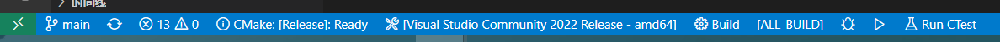

# Mastering CMake

*Mastering CMake* study notes

[Mastering CMake](https://cmake.org/cmake/help/book/mastering-cmake/index.html)

## Getting Started

### Hello World for CMake

`cmake_minimum_required`, the first line of the top level CMakeLists file should always be.

This allows projects to require a given **version of CMake** and, in addition, allows CMake to be **backwards compatible(向后兼容)**.

设定CMake版本并且支持向后兼容

`project`, the next line of any top level CMakeLists file should be.

This command sets **the name of the project** and **may specify other options** such as language or version.

设置工程名称, 也可以设置语言、版本等其他信息（后面应该会有详细说明）

The project will contain all targets that are in the CMakeLists.txt file and any subdirectories, as specified by the `add_subdirectory` command.(If the `EXCLUDE_FROM_ALL` option is used in the `add_subdirectory` command, the generated project will not appear in the top-level Makefile or IDE project file; this is useful for generating sub-projects that do not make sense as part of the main build process.)

project会链接所有的targets, 包括通过`add_subdirectory`添加的子目录, 除非在子目录中设置`EXCLUDE_FROM_ALL`。

`add_executable`, be used to add an executable to the project using the given source file.

### Configure and Generate

After a CMakeLists file has been created, CMake processes the text file and creates entries in a cache file. Users may edit the CMakeLists file or specify cache values with the CMake gui or ccmake and re-configure. Next, CMake uses the cache entries to generate a project in the user’s desired build system (e.g. Makefile or Visual Studio solution).

写好CMakeLists.txt后，就需要配置和生成项目，可以通过gui/command等多种途径。但是在配置前还需要进行一些设置, 例如构建目录、设置编译器等。

### Specifying the Compiler to CMake

The `CC` environment variable specifies the C compiler, while `CXX` specifies the C++ compiler.You can specify the compilers directly on the command line by using `-DCMAKE_CXX_COMPILER=cl` for example.

Once cmake has been run and picked a compiler, if you wish to change the compiler, start over with **an empty binary directory**.

The flags for the compiler and the linker can also be changed by setting environment variables. Setting `LDFLAGS` will initialize the cache values for link flags, while `CXXFLAGS` and `CFLAGS` will initialize `CMAKE_CXX_FLAGS` and `CMAKE_C_FLAGS` respectively.

通过`-DCMAKE_CXX_COMPILER=cl`命令可以设置C++编译器为cl(不过在VSCode、VisualStudio等具备CMake相关组件的IDE中, 都具有可视化的编译器设置选项)。



### Build Configurations

Build configurations allow a project to be built in different ways for debug, optimized, or any other special set of flags. CMake supports, by **default**, **Debug**, **Release**, **MinSizeRel**, and **RelWithDebInfo** configurations.

- Debug has the basic debug flags turned on.
- Release has the basic optimizations turned on.
- MinSizeRel has flags that produce the smallest object code, but not necessarily the fastest code.
- RelWithDebInfo builds an optimized build with debug information as well.

CMake handles the configurations in slightly different ways depending on the generator being used.

但不同的generator，可能使CMake在处理配置的方法略有不同。

The Visual Studio IDE supports the notion of Build Configurations. A default project in Visual Studio usually has Debug and Release configurations. From the IDE you can select build Debug, and the files will be built with Debug flags. The IDE puts all of the binary files into directories with the name of the active configuration. This brings about an extra complexity for projects that build programs that need to be run as part of the build process from custom commands.

这一段不是很理解...

With Makefile-based generators, only one configuration can be active at the time CMake is run, and it is specified with the CMAKE_BUILD_TYPE variable。

构建项目时，可以通过`-DCMAKE_BUILD_TYPE=Debug/Release`来指定构建类型。

### Building Your Project

Another option is to use cmake’s `--build` option from the command line. This option is simply a convenience that allows you to build your project from the command line, even if that requires launching an IDE.

`cmake --build _build`, 在`./_build`文件夹中构建项目。

### 总结

写CMakeLists.txt时, 最基础的文件应包含`cmake_minimum_required(VERSION 3.26.0)`和`project(name)`, 通过`add_executable(exe_name hello_world.cpp)` 来添加可执行文件。

在编译和构建CMake项目时, 可以通过`-DCMAKE_CXX_COMPILER=<complier>` 设置编译器, 通过`-DCMAKE_BUILD_TYPE=<build_type>`设置编译类型, 通过`--build`设置编译目录。

## Writing CMakeLists Files

The CMake language is composed of **comments(注释)**, **commands(命令)**, and **variables(变量)**.

### Comments(注释)

Comments start with # and run to the end of the line. See the [cmake-language](https://cmake.org/cmake/help/latest/manual/cmake-language.7.html) manual for more details.

在CMakeLists文件中,由`#`起始的行为注释行

### variables(变量)

CMakeLists files use variables much like any programming language. CMake variable names are **case sensitive(大小写敏感)** and may only contain **alphanumeric characters字母字符** and **下划线**.

A number of useful variables are automatically defined by CMake and are discussed in the [cmake-variables](https://cmake.org/cmake/help/latest/manual/cmake-variables.7.html) manual. These variables begin with `CMAKE_`. Avoid this naming convention (and, ideally, establish your own) for variables specific to your project.

All CMake variables are stored internally as **strings** although they may sometimes be interpreted as other types.

Use the `set` command to set variable values. In its simplest form, the first argument to `set` is the name of the variable and the rest of the arguments are the values. Multiple value arguments are packed into a semicolon-separated list and stored in the variable as a string. For example:

```cmake
set(Foo "")      # 1 quoted arg -> value is ""
set(Foo a)       # 1 unquoted arg -> value is "a"
set(Foo "a b c") # 1 quoted arg -> value is "a b c"
set(Foo a b c)   # 3 unquoted args -> value is "a;b;c"
```

`set`命令, 简单的语法是变量名+参数/字符串, 如果输入多个参数会被拼接成以分号`;`分割符的一个字符串。

Variables may be referenced in command arguments using syntax `${VAR}` where `VAR` is the variable name.

If the named variable is not defined, the reference is replaced with an empty string; otherwise it is replaced by the value of the variable. Replacement is performed prior to the expansion of unquoted arguments, so variable values containing semicolons are split into zero-or-more arguments in place of the original unquoted argument.For example:

```cmake
set(Foo a b c)    # 3 unquoted args -> value is "a;b;c"
command(${Foo})   # unquoted arg replaced by a;b;c and expands to three arguments

command("${Foo}") # quoted arg value is "a;b;c"
set(Foo "")       # 1 quoted arg -> value is empty string
command(${Foo})   # unquoted arg replaced by empty string and expands to zero arguments

command("${Foo}") # quoted arg value is empty string
```

通过`${VAR}`可以调用变量，使用变量`VAR`的值`VALUE`。如果变量未被定义使用时会被`替换(replace)`成一个空字符串`""`。且`替换`动作发生在VALUE的展开前，所以包含分号`;`的值`VALUE`是被拆分为多个参数后, 再替换`${VAR}`

**System environment variables(系统环境变量)** and **Windows registry values(注册表值)** can be accessed directly in CMake. To access system environment variables, use the syntax `$ENV{VAR}`. CMake can also reference registry entries in many commands using a syntax of the form `[HKEY_CURRENT_USER\\Software\\path1\\path2;key]`, where the paths are built from the registry tree and key.

`$ENV{VAR}`可以直接读取环境变量。(注册表值没试过)

### Variable Scope

变量范围

Variables in CMake have a scope that is a little different from most languages. When you set a variable, it is visible to the current CMakeLists file or function and any subdirectory’s CMakeLists files, any functions or macros(宏) that are invoked(调用), and any files that are included using the `include` command.

 When a new subdirectory is processed (or a function called), a new variable scope is created and initialized with the current value of all variables in the calling scope. Any new variables created in the child scope, or changes made to existing variables, will not impact the parent scope.

 There is a way for CMake to return a value from a function, and it can be done by using the PARENT_SCOPE option with the set command.

 ```cmake
function(foo)
  message(${test}) # test is 1 here
  message(${test_2}) # test_2 is 1 here
  set(test 2)
  set(test_2 2 PARENT_SCOPE)
  message(${test}) # test is 2 here, but only in this scope
  message(${test_2}) # test_1 still 1 in this scope
endfunction()

set(test 1)
set(test_2 1)
foo()
message(${test}) # test will still be 1 here
message(${test_2}) # test_2 will now be 2 here
 ```

CMakeLists.txt中设置的变量，在当前文件或函数、子目录文件、所有被调用的函数或宏、以及使用`include`命令引用的文件中可见。

子目录或函数中修改上一区域(parent scope)的变量, 只会影响当前区域该变量的值, 改变量在上一区域的使用时不受任何影响。

但如果在`set(VAR VALUE PARENT_SCPOE)`加入`PARENT_SCPOE`，就会修改该变量在上一区域的值，而不会修改当前区域。

### Commands(指令)

A command consists of the **command name**, **opening parenthesis**, **whitespace separated arguments**, and a **closing parenthesis**. Each command is evaluated in the order that it appears in the CMakeLists file. See the [cmake-commands](https://cmake.org/cmake/help/latest/manual/cmake-commands.7.html) manual for a full list of CMake commands.

CMake is **no longer case sensitive** to command names, so where you see `command`, you could use `COMMAND` or `Command` instead.It is considered best practice to use lowercase commands.All whitespace (**spaces**, **line feeds**, **tabs**) is ignored except to separate arguments.Therefore, commands may span multiple lines as long as the command name and the opening parenthesis are on the same line.

与参数不同，命令对大小写不敏感。建议使用小写输入命令。命令中的空白都会被忽略（使用该特征可以执行命令中参数之间的换行等操作），但要保证命令名称与开始的左括号在同一行。

常见命令有：

- set, 设置普通变量、缓存变量、或环境变量
- unset, 消除普通变量、缓存变量、或环境变量
- string, 字符串操作, 包括查找替换(find, replace)、复杂操作(append, tolower, toupper, length...)、对比(compare)、哈希(hash)...
- list, 列表操作, 包与string类似, 但操作对象不同
- separate_arguments, 解析命令行参数
- add_executable, 新增可执行文件
- add_library, 新增库文件
- ...

### Conditional Statements (if)

if else,

```cmake
if(FOO)
  # do something here
else()
  # do something else
endif()
```

if elseif,

```cmake
if(MSVC80)
  # do something here
elseif(MSVC90)
  # do something else
elseif(APPLE)
  # do something else
endif()
```

### Looping Constructs (foreach, while)

foreach

### Procedure definitions (macro, function)

## CMake Cache

## Key Concepts

## Policies

## Modules

## Installing Files

## System Inspection

## Finding Packages

## Custom Commands

## Converting Existing Systems To CMake

## Cross Compiling With CMake

## Packaging With CPack

## Testing With CMake and CTest

## CDash

## CMake Tutorial

## User Interaction Guide

## Using Dependencies Guide

## Importing and Exporting Guide

## IDE Integration Guide
