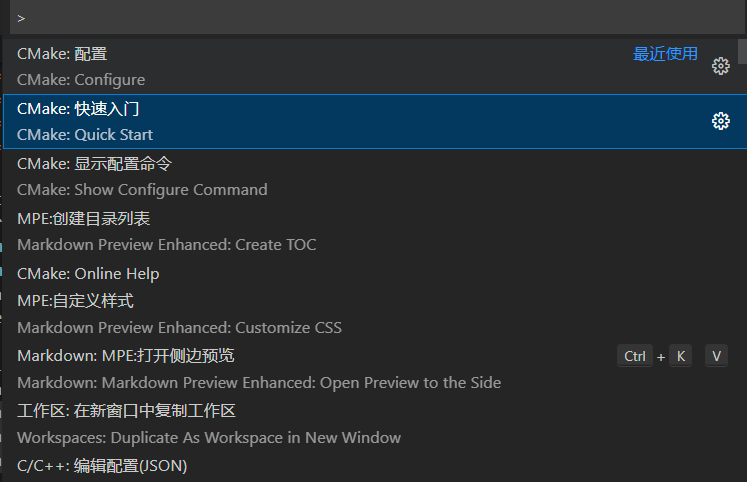

# vscode + mingw(windows)

仅记录vscode与mingw的组合使用方法，不涉及复杂的cmake语法。

## 准备工作

### mingw 编译器下载

1. Qt安装包一般自带mingw编译器
2. msys2可以很方便的下载mingw编译器以及相关软件包

### vscode配置

下载`CMake Tools`拓展包，在`设置(settings.json)`(`ctrl`+`,`)中设置cmake信息，分别添加cmake.exe、ctest.exe和mingw32-make.exe

```json
"cmake.cmakePath": "D:\\CMake\\bin\\cmake.exe",
"cmake.ctestPath": "D:\\CMake\\bin\\ctest.exe",
"cmake.generator": "D:\\Qt\\Qt5.12.0\\Tools\\mingw730_64\\bin\\mingw32-make.exe",
```

最好在环境变量PATH中添加mingw32-make.exe所在的路径。

## Quick Start

`ctrl`+`shift`+`p`打开命令窗口，输入cmake，根据提示点击Quick Start可以在当前文件夹中快速生成一个CMakeLists.txt文档。



生成的CMakeLists.txt如下所示：（之前已经写好main.cpp）

```cmake
cmake_minimum_required(VERSION 3.0.0)
project(project_quick_start VERSION 0.1.0)

include(CTest)
enable_testing()

add_executable(project_quick_start main.cpp)

set(CPACK_PROJECT_NAME ${PROJECT_NAME})
set(CPACK_PROJECT_VERSION ${PROJECT_VERSION})
include(CPack)
```

## 编译

1. 在命令行（终端）输入`cmake -S . -B build -G "MinGW Makefiles"`构建生成Makefiles；

   - -S 指定编译地址（此处"."表示当前路径）
   - -B 指定编译路径，为当前路径下的build文件夹内
   - -G 指定编译器，使用mingw32-make.exe编译
   - 更多信息通过`cmake --help`查看学习

2. `cd ./build` 切换到生成的makefile所在的目录；

3. mingw32-make.exe 执行`Makefile`文件，生成最终的库或可执行文件。

tree:(*为关键文件)

```cmd
cmakelist_test/
├── CMakeLists.txt*
├── build
│   ├── CMakeCache.txt
│   ├── CMakeFiles
│   │   ├── CMakeDirectoryInformation.cmake
│   │   └── ...
│   ├── CPackConfig.cmake
│   ├── CPackSourceConfig.cmake
│   ├── CTestTestfile.cmake
│   ├── DartConfiguration.tcl
│   ├── Makefile*
│   ├── Testing
│   │   └── Temporary
│   ├── cmake_install.cmake
│   └── project_quick_start.exe*
└── main.cpp*
```
