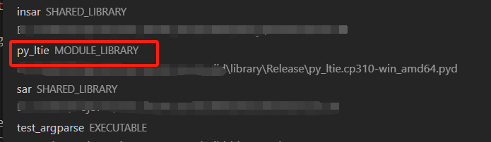
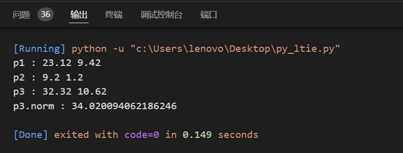
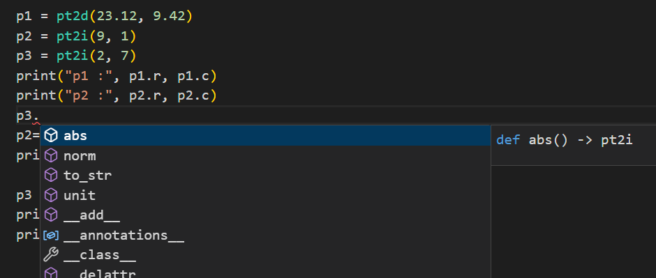

# pybind11


使用CMake + Pybind11, 将C++写的算法/类，导出到Python中，类似于一个Python库/包

## 导入pybind11

1. vcpkg

cd到vcpkg根目录下, 下载pybind11库

```shell
vcpkg install pybind11:x64-windows --clean-after-build
```

在CMakeLists.txt内添加如下字段

```cmake
find_package(Python COMPONENTS Interpreter Development)
find_package(pybind11 CONFIG)

```

2. sub_directory

pybind11是一个header-only库, 所以直接把它当做子项目加载到当前项目中也非常方便

从github下载[pybind11](https://github.com/pybind/pybind11)到指定路径。

项目结构，如下所示

```shell
projects/
    pybind11/   <-- 从github上下载的pybind11项目
        docs/
        include/
        tools/
        ...
        setup.py
        CMakeLists.txt
    mylib.cpp
    CMakeLists.txt  <-- 项目根目录的CMakeLists.txt
```

在外侧CMakeLists.txt中添加如下字段

```cmake
add_subdirectory(pybind11)
```

## 创建模板库

不同于C++中常见的可执行文件'executable', 动态库'shared library', 又或是静态库'static library', pybind11的目标在VSCode被标记为模板库'module library'。

在创建模板库时也不应该使用C++中常用的`add_library`, `add_executable`, 而是`pybind11_add_module`.

```cmake
# CMakeLists.txt
pybind11_add_module(py_ltie
        your_libs.cpp)
target_link_libraries(py_ltie PUBLIC my_utils)  
target_link_libraries(py_ltie PUBLIC my_algo)   # my_utils, my_algo 都是依赖库
target_link_libraries(py_ltie PRIVATE pybind11::lto pybind11::embed pybind11::module pybind11::headers)
```

执行一次CMake后, 该目标会显示在IDE(VSCode)中,



## pybind"语法"

几乎所有语法都是写在`PYBIND11_MODULE(name, varible)`宏内。其中`name`名字应该与`pybind11_add_module`的第一个参数相同，`varible`则随意设置一个变量即可。

与上面CMake代码相对应的，

```c++
/// your_libs.cpp
#include <pybind11/pybind11.h>
namespace py = pybind11;

PYBIND11_MODULE(py_ltie, m) {
    /* 更多内容... */
}
```

`your_libs.cpp` 建议是一个独立的cpp文件, 它可以通过`#include <...>` 加载其他库里的类和函数, 而不需要在该文件中重新定义。

~~下面提到`PYBIND11_MODULE`的代码块, 都默认使用了`#include <pybind11/pybind11.h>`和`namespace py = pybind11;`, 也就不再赘述了~~

### 函数

大部分“蜻蜓点水”式介绍pybind11的文章/视频，都会提到。

实际上就是用了pybind官方文档的[First steps #Creating bindings for a simple function](https://pybind11.readthedocs.io/en/stable/basics.html#creating-bindings-for-a-simple-function)的内容...

写一个函数, 就完事了。完整的代码示例如下：

```c++
/// your_libs.cpp
#include <pybind11/pybind11.h>

int add(int i, int j) {
    return i + j;
}

PYBIND11_MODULE(py_ltie, m) {
    m.doc() = "pybind11 example plugin"; // optional module docstring
    m.def("add", &add, "A function that adds two numbers");
}
```

在我还不太理解pybind11工作原理的时候，这么点示例完全不够我去举一反三的。我甚至一度以为要在自己的每个cpp下面都加一个`PYBIND11_MODULE`...

有一点需要注意：

```c++
      这里的py_lite ↓  应该与cmakelist.txt里的'py_lite'保持一致(否则会在import py_lite时提示动态模板没有初始化)
PYBIND11_MODULE(py_ltie, m) {    <-- 这里的m
  和这个m需要保持一致 --> m.def("add", &add, "A func...");
}
```

言归正传，普通函数的转换语法为：

```c++
PYBIND11_MODULE(py_ltie, m) {
    m.def("add", &add, "A function that adds two numbers");
}
```

第一个参数, `"add"`是在该函数在python中的名称；

第二个参数，`&add`是输入了该函数的地址

第三个参数，`"A func..."`是对该函数的解释说明（在[pybind11-stubgen](#pybind11-stubgen)章节生成pyi文件后, IDE中就会显示该函数的解释说明）

### 类

面向对象是C++内常见的编程思路，所以自定义的类才是最需要提供python接口的... 但网上愿意翻译一下官方文档讲一下它的人愣是没几个...

前提：

我之前写了一个小工具动态库`my_utils.dll`，并且该库已经通过`target_link_libraries`加载到`py_lite`模板库中。

其中在utils/datatype.h中我定义了一个结构体`xyz`用于存放空间直角坐标系数据, 形如

```c++
/// include/utils/datatype.h
class llh; /// longitude, latitude, height
class xyz 
{
public:
    xyz();
    ~xyz();
    xyz(double X, double Y, double Z);
    double norm();
    xyz abs();
    xyz unit();
    xyz cross(xyz sec);
    xyz operator-(xyz sec);
    xyz operator+(xyz sec);
    double operator*(xyz sec);
    xyz operator*(double m);
    llh to_llh();
    llh to_llh(double major, double minor);
    void from_llh(llh lonlathei, double major, double minor);

public:
    double x, y, z;
};

/// src/utils/datatype.cpp

/* 存放相应的函数实现代码 */

```

转换语法

```c++
/// your_libs.cpp
#include <pybind11/pybind11.h>
namespace py = pybind11;
#include <utils/datatype.h> /// 这是我自己写的动态库, 在CMakeLists中已经通过`target_link_libraries`链接了

PYBIND11_MODULE(py_ltie, m) {
    py::class_<xyz>(m, "xyz")
        .def(py::init<>())
        .def(py::init<double, double, double>())
        .def_readwrite("x",&xyz::x)
        .def_readwrite("y",&xyz::y)
        .def_readwrite("z",&xyz::z)
        /*其他成员变量*/
        .def("norm",&xyz::norm)
        .def("abs",&xyz::abs)
        .def("unit",&xyz::unit)
        .def("cross",&xyz::cross);
}    

```

1 `py::class_<>()`

`py::class_<llh>(m, "xyz")`是在python中创建一个llh类，其中第一个`<xyz>`是C++中的类，第二个`"xyz"`是该类在python中的名称，即调用方法。在后面加`.def`, `.def_readonly`, `.def_readwrite`的行为，就是在python中为该类夹可以调用的成员函数、成员变量等内容...

2 构造函数

首先，构造函数是必须存在的。因为我在llh类中设置了两种构造函数，一种是不需要入参的`xyz()`，另一种是有三个入参的`xyz(double, double, double)`，所以我需要写两个`py::init`（我也可以不写全，但没写的构造方法也就没办法在python中使用）。

`.def(py::init<>())`对应`xyz()`, `.def(py::init<double, double, double>())`对应`xyz(double, double, double)`。如果你的类里有其他的构造函数，依次类推...

3 共有成员变量

`.def_readwrite("x",&xyz::x)`可以为成员变量`x`提供有可读可写的接口。第一个`"x"`该成员函数在python中的名称，也是调用方法。第二个`&xyz::x`是它的地址。如果我们想设置只读类型的接口，可以把`.def_readwrite(...)`替换为`.def_readonly(...)`。

4 私有成员变量

对于私有变量(`private:`), 可以使用`.def_property("name", &class::get, &class::set)`定义

TODO: 没写完, 以后用到了再补充

5 成员函数

方法与成员变量类似。

以`.def("norm",&xyz::norm)`为例，该函数是计算坐标模长的函数。第一个`"norm"`是该成员变量在python中的名称，也是调用方法。第二个`&xyz::norm`是它的函数地址。

### 重载的成员函数

由于python并不支持函数重载，所以对于C++类里重载的成员函数，pybind11提供的方法是：`py::overload_cast<double>(&class::func)`, 将重载函数定义不同的调用方法。

仍以[类](#类)中提到的`xyz`为例，成员函数`to_llh()`存在重载情况，实现方法为,

```c++
/// your_libs.cpp
#include <pybind11/pybind11.h>
namespace py = pybind11;
#include <utils/datatype.h> 

PYBIND11_MODULE(py_ltie, m) {
    py::class_<xyz>(m, "xyz")
        .def(py::init<>())
        .def(py::init<double, double, double>())
        .def("to_llh_wgs84", py::overload_cast<>(&xyz::to_llh))
        .def("to_llh", py::overload_cast<double, double>(&xyz::to_llh))
        /*其他成员变量 或成员函数*/
        .def("cross",&xyz::cross);
}
```

通过`py::overload_cast<..>(..)`,

将不需要入参、默认使用WGS84椭球参数的函数`to_llh`在python的调用方法，修改为`"to_llh_wgs84"`,

将需要输入椭球长短半轴的函数`to_llh`在python中的调用方法，修改为`"to_llh"`

### operator

1 加减乘除双目运算符

仍以[类](#类)中提到的`xyz`为例，类里包含了加减乘除运算符，实现方法为,

```c++
/// your_libs.cpp
#include <pybind11/pybind11.h>
namespace py = pybind11;
#include <utils/datatype.h> 

PYBIND11_MODULE(py_ltie, m) {
    py::class_<xyz>(m, "xyz")
        .def(py::init<>())
        .def(py::init<double, double, double>())
        .def("__add__", &xyz::operator+)
        .def("__sub__", &xyz::operator-)
        .def("__mul__", &xyz::operator*)
        .def("__truediv__", &xyz::operator/)
        /*其他成员变量 或成员函数*/
        .def("cross",&xyz::cross);
}
```

2 bool隐式转换

另一个类`funcrst`，是执行函数返回的信息，记可隐式转换为bool值, 直接使用if判断是否执行成功

```c++
struct funcrst{
    funcrst() { result = false; explain = ""; };
    funcrst(bool b, std::string s) { result = b; explain = s; }
    bool result{ false };
    std::string explain{ "" };
    operator bool() { return result; }
};
```

语法为，

```c++
/// your_libs.cpp
#include <pybind11/pybind11.h>
namespace py = pybind11;
#include <utils/datatype.h> 

PYBIND11_MODULE(py_ltie, m) {
    py::class_<xyz>(m, "xyz")
        /* ... */
        .def(py::init<>());

    py::class_<funcrst>(m, "funcrst")
        .def(py::init<>())
        .def(py::init<bool, std::string>())
        .def_readwrite("result",&funcrst::result)
        .def_readwrite("explain",&funcrst::explain)
        .def("__bool__", &funcrst::operator bool);
}
```

### 枚举

c++中的（强）枚举，

```c++
enum class Look_Diredction      { error, left, right }; 
```

转到pybind11, 

```c++
/// your_libs.cpp
#include <pybind11/pybind11.h>
namespace py = pybind11;
#include <utils/datatype.h> 
#include <algo/datatype.h>

PYBIND11_MODULE(py_ltie, m) {
    py::class_<xyz>(m, "xyz")
        /* ... */
        .def(py::init<>());

    py::class_<funcrst>(m, "funcrst")
        /* ... */
        .def(py::init<>());

    py::enum_<Look_Diredction>(m, "look_direction")
        .value("error", Look_Diredction::error)
        .value("left", Look_Diredction::left)
        .value("right", Look_Diredction::right)
        .export_values();
}
```

### 模板类

以`pt2<>`为例, 是一个存放和计算像平面坐标的模板类, 

```c++
/// include/utils/datatype.h
template<typename type>
class pt2
{
    static_assert(std::is_same<type, int>::value || std::is_same<type, double>::value 
                  , "Type must be short int, or double.");
public:
    pt2() :c(0), r(0) {};
    pt2(type row_, type col_) :c(col_), r(row_) {};

    type norm() { ...};
    pt2<type> abs_() { ... };
    pt2<type> unit() { ...};

    bool operator !=(pt2<type> src) {return !operator==(src);};
    bool operator ==(const pt2<type> src) {...};
    pt2<type> operator-(pt2<type> src) {...};
    pt2<type> operator+(pt2<type> src) {...};
    pt2<type> operator/(const type m) {...};
    pt2<type> operator*(const type m) {...};

    template<typename _Ty2>
    pt2<_Ty2> to() {
        return pt2<_Ty2>(this->r, this->c);
    }

public:
    type r; /// @brief equal with 'y' & 'row'
    type c; /// @brief equal with 'x' & 'col'
};
```

我们需要在python中提供`pt2<int>`和`p2<double>`的数据接口，那么需要在`your_libs.cpp`中定义一个模板函数"特化"的函数。

```c++
template <typename T>
void template_pt2(py::module& m, const std::string& className) {
    py::class_<pt2<T>>(m, className.c_str())
        .def(py::init<>())
        .def(py::init<T, T>())
        .def("norm",&pt2<T>::norm)
        .def("abs",&pt2<T>::abs_)
        .def("unit",&pt2<T>::unit)
        .def("__add__", &pt2<T>::operator+)
        .def("__sub__", &pt2<T>::operator-)
        .def("__mul__", &pt2<T>::operator*)
        .def("__truediv__", &pt2<T>::operator/)
        .def_readwrite("r", &pt2<T>::r)
        .def_readwrite("c", &pt2<T>::c);
}

PYBIND11_MODULE(py_ltie, m) {
    /* 其他定义 */
    template_pt2<int>(m, "pt2i");
    template_pt2<double>(m, "pt2d");
}
```

### TODO

派生类, 静态变量等... 以后有机会接触到了再完善相关内容

## pyd使用

完成上述内容后, 通过编译可以得到几个文件

- py_ltie.cp310-win_amd64.pyd
- py_ltie.exp
- py_ltie.lib
- python310.dll

(因为我链接的python版本是310, C++编译器是amd64版, 所以得到的pyd文件的后缀是“cp310-win_amd64.pyd”)

将这些文件与`my_utils.dll`, `my_algo.dll`依赖的三方动态库，放到同一目录下（最好可以被python检索到）

比如，这py_ltie依赖`my_utils.dll`, `my_algo.dll`，而俩动态库又依赖gdal, fmt, tinyxml2, nlohoman_json, fftw等动态库。但通常在编译`my_utils.dll`和 `my_algo.dll`时，系统就已经配好环境了。

我将它们（pyd, mu_utils.dll, my_algo.dll, gdal.dll, libtiff.dll, ...）打包放到`d:/python310/Lib/site-packages/ltie/`地址内。（ltie是该工程的命名缩写）

任意位置创建一个.py文件, 写入

```python
from ltie.py_ltie import pt2d

p1 = pt2d(23.12, 9.42)
p2 = pt2i(9.2, 1.2)
p3 = p1 + p2
print("p1 :", p1.r, p1.c)
print("p2 :", p2.r, p2.c)
print("p3 :", p3.r, p3.c)
print("p3.norm :", p3.norm())
```

`from ltie.py_ltie import pt2i`中,

- `ltie`是site-packages下的文件夹"ltie"
- `py_ltie`是我们生成的pyd文件,
- `pt2i`是py_ltie中的一个特化模板类

执行python脚本, 得到结果如下所示



## pybind11-stubgen

生成pyd文件后, 我们已经可以基于它编写python脚本, 但没有智能提示会导致非常容易写错代码, 所以我们需要借助`pybind11-stubgen`工具来制作与pyd文件相对应的pyi文件，使IDE的智能提示功能正常工作。

安装

```shell
pip install pybind11-stubgen
```

输入`pybind11-stubgen -v`可以查看是否安装成功。

在保证pyd文件可以被python工具检索到后, 输入`pybind11-stubgen.exe py_ltie`, 如果没有快速报错, 一般就是输出成功了

结束后会在当前地址(比如我所使用设备的powershell的默认地址是c:/user/lenovo)创建一个stubs文件夹, 里面有一个ltie文件夹, 里面存放这一个py_ltie.pyi

将pyi文件拷贝至site-packages/ltie/后, 再次使用VSCode写代码时, 就出现了智能提示。


