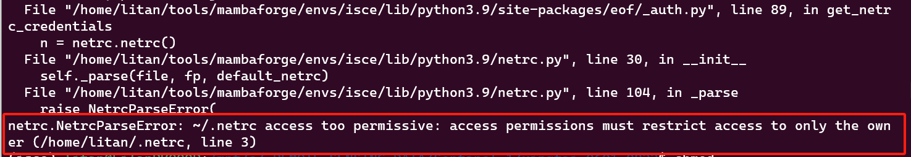

## elevation

DEM下载工具 (需要有GNU make)

安装: pip install elevation

下载数据:

```shell
eio clip -o name.tif --bounds left down right top
```

可选的下载数据类型:

```shell
eio --product [SRTM1|SRTM3|SRTM1_ELLIP] clip -o name.tif --bounds left down right top
```

clip指令的自选项:

- -o, --output PATH     DEM的地址, 默认值为“out.tif”, 已存在文件会被覆盖
- --bounds FLOAT...     DEM的范围, 顺序为左, 下, 右, 上
- -m, --margin TEXT     Decimal degree margin added to the bounds. Use '%' for percent margin.  [default: 0]
- -r, --reference TEXT  使用GDAL/OGR的数据的范围代替bounds的边界

## sentineleof

Tool to download Sentinel 1 precise/restituted orbit files (.EOF files) for processing SLCs

下载Sentinel-1的EOF精轨数据

前置设置

在~/.netrc文件中添加CDSE或Earthdata的用户名和密码，下载数据时使用

```shell
machine dataspace.copernicus.eu
  login MYUSERNAME
  password MYPASSWORD

machine urs.earthdata.nasa.gov
  login MYUSERNAME
  password MYPASSWORD
```

(确认.netrc文件的权限是600, 否则执行脚本时会报错)



1.下载本地sentinel-1数据对应的精轨数据

将当前地址切换到sentinel-1文件所在目录下，执行

```shell
eof
```

即可下载sentinel-1数据对应的eof文件

> eof支持压缩的zip文件以及解压缩的SAFE folders两种格式

2.指定精轨数据下载

eof也可以指定搜索路径和输出路径, 执行

```shell
eof --search-path /path/to/safe_files/ --save-dir ./orbits/
```

会检索`/path/to/safe_files/`地址下的sentinel-1数据, 下载对应的EOF精轨文件, 保存到`./orbits/`地址下(如果文件不存在则会创建)。
