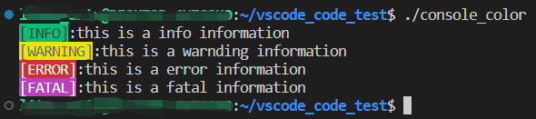

# Std

一些标准库的使用方法

## ofstream

```C++
#include<fstream>
ofstream temp(Filepath.txt);
temp<<………;
temp.close();
```

### 精度设置

```C++
std::ofstream(const char* filepath);
// 不适用科学计数法表示
ofs<<std::fixed 
// 有效数字位数
ofs.precision(int num);
// 当输出一行数字的精度不同时, 每次修改精度前单独设置一次
ofs<<num<<"\t";
ofs.precision(5);
ofs<<iter.incidence<<"\t";
ofs.precision(2);
ofs<<iter.row<<"\t"<<iter.col<<"\t";
ofs.precision(5);
ofs<<iter.point.x<<"\t"<<iter.point.y<<"\t"<<iter.point.z<<"\n";
// ...
ofs.close();
```

### 占位符 & 输出位置

```C++
ofs<<std::right;
    ofs<<std::setw(4)<<1<<std::setw(4)<<10<<std::setw(4)<<100<<std::endl;
    ofs.close();

/// 输出结果格式如下
/// “___1__10_100”(将空格替换为下划线方便查看间距)
```

## ifstream

```c++
ifstream ifs;
ifs.open(txtsrc);
if (!ifs.is_open()){
    return false;
}
 
string str;
string Separator = string(",");
while (getline(ifs, str))
{
    /// str...
}
ifs.close();
```

### 二进制文件读取及跳字节

场景：2022.3.17 其他软件无法正常显示.dat

```C++
std::ifstream ifs("filepath",ifsteam::binary);
if(!ifs.is_open()){
    return false;
}
double value;
while(ifs.read((char*)value,sizeof(double)/*8*/))
{
    //如果value异常 （error只是一个假想的函数）
    if(error(value)){
        //ifs指针从当前位置（ios::cur）向前跳n-1的字节，
        ifs.seekg(1-sizeof(double),ios::cur);
        continue;
    }
}
```

`std::ifstream ifs("filepath",ifsteam::binary)`，用二进制方式读取文件。

`ifs.read(char_type* ,streamsize )`，每次读取`streamsize`长度的字节数，并存储到指定位置(`char_type*`)。

seekg:

`ifs.seekg(off_type,ios_base::seekDir)` ifs的当前指针移动到`seekDir`处并偏移`off_type`字节。

ios_base::seekDir:
`ios::beg` 表示输入流的开始位置

`ios::cur` 表示输入流的当前位置

`ios::end` 表示输入流的结束位置

## filesystem

c++17, 类似于QFileInfo

```C++
#include <filesystem>
namespace fs = std::filesystem;
std::string root_path;
fs::path fs_path(root_path);
bool ans;
std::string str_path = fs_path.string(); //路径转字符串
ans = fs_path.is_directory();  //文件夹
ans = fs_path.is_regular_file();   //文件
fs::path fs_parentpath = fs_path.parent_path(); //文件的路径

fs::path filename = fs_path.filename(); //文件名
fs::path extension = fs_path.extension(); //拓展名（后缀）

for (auto& iter : directory_iterator(root_path)){
    //查看当前路径下的所有文件/文件夹
}

for (auto& iter : recursive_directory_iterator(root_path)){
    //迭代查看当前路径及子文件内的所有文件/文件夹
}
```

## chrono

### 计时功能

```c++
auto start = std::chrono::system_clock::now();
func();/// 一个费时的函数
auto end = std::chrono::system_clock::now();
auto duration = std::chrono::duration_cast<std::chrono::microseconds>(end - start);
cout <<  "Spent" << double(duration.count()) * std::chrono::microseconds::period::num / std::chrono::microseconds::period::den << " seconds." << endl;
```

C++11的 `#include<chrono>` 通过模板调整精度可以达到微妙级，相比传统的`#include <ctime>` 精度更高。

### chrono::time_point -> string

``` c++
auto tp = std::chrono::system_clock::now(); // time_point
time_t time = std::chrono::system_clock::to_time_t(tp);
std::stringstream ss;
ss << std::put_time(std::localtime(&time), "%Y-%m-%d %H:%M:%S");
std::string str = ss.str();
```

首先通过`to_time_t`将`time_point`转换为`time_t`，然后使用`std::localtime()`将`time_t`转换为`tm`，再使用`put_time()`将`tm`转换为指定输出格式的`_TimeObj`，存储到`stringstream`中，最后通过`stringstream::str()`转换为string。

如果使用`tm`存储时间数据，则可以直接使用`put_time`将时间转换为字符串。

### put_time & get_time

按照指定格式输出和获取时间

参考资料：[get_time](http://www.bytekits.com/cppstdlib/cppstdlib-get-time.html), [put_time](http://www.bytekits.com/cppstdlib/cppstdlib-put-time.html)。

put_time的链接中包含了支持的各种格式说明，同样适用于get_time

例如：

说明符 |  替换 | 示例
:---: | :---: | :---:
%y|年份，最后两位数字（00-99）|01
%Y|年份，四位数字|2001
%m|月份的十进制数（01-12）|08
%M|分钟（00-59）|56
%d|月份中的某一天，用零填充（01-31）|23
%D|MM/DD/YY日期的简写，相当于％m/％d/％y|08/23/19
%F|YYYY-MM-DD日期的简写，相当于％Y-％m-％d|2023-04-14
...|...|...

示例：

```c++
std::tm t = {};
std::istringstream ss("2011-Februar-18 23:12:34");
ss.imbue(std::locale("de_DE.utf-8"));
ss >> std::get_time(&t, "%Y-%b-%d %H:%M:%S");

if (ss.fail())
  std::cout << "Parse failed\n";
else
  std::cout << std::put_time(&t, "%c") << '\n';
```

copy from CMake Cookbook 3.7章节

```c++
// copy from CMake Cookbook 3.7章节
std::chrono::time_point<std::chrono::system_clock> start, end;
std::chrono::duration<double> elapsed_seconds;
std::time_t end_time;
start = std::chrono::system_clock::now();
// ...
end = std::chrono::system_clock::now();
// Report times
elapsed_seconds = end - start;
end_time = std::chrono::system_clock::to_time_t(end);
std::cout <<"matrices allocated and initialized"
          <<std::put_time(std::localtime(&end_time),"%a %b %d %Y %r\n")
          <<"elapsed time: "
          <<elapsed_seconds.count()<<"s\n";

// cmd打印内容
// matrices allocated and initialized Sun Jun 17 2018 11:04:20 AM
// elapsed time: 0.0492328s
```

## popen

可调用cmd，并且获取cmd实时的（每一行）输出结果，代码与控制台的交互。

示例：

通过调用cmd，执行`pip list`命令，该命令是查看pip包管理工具中已安装的依赖库

```C++
char buffer[1024];
const char* szCmd = "pip";
FILE* pipe = _popen(szCmd, "r");
if (pipe != nullptr) {
    while (fgets(buffer, 1024, pipe) != NULL){
        std::cout << std::string(buffer);
    }
    fclose(pipe);
}

```

## map

### map与三种函数关联的方法

通过map容器，将枚举或字符串与函数（通过函数指针或std::function等方法）相关联, 可以实现在循环中根据枚举或字符串选择函数的功能。

#### 普通的函数指针

适用于调用普通的函数

```c++
bool fun1(int){
    ///...
}
bool fun2(int){
    ///...
}

std::map<std::string, bool(*)(int)> funs_ = {
    {"fun1", func1},
    {"fun2", func2}
}

bool b = funs_["fun1"](10);
```

#### 类函数指针

可以调用类里的函数

```c++
/// .h
class Cs
{
    /// ...
    void func1(const std::string&);
    void func2(const std::string&);

    /// 定义函数指针
    typedef void(Cs::*funcs_ptr)(const std::string&);
    std::map<std::string, funcs_ptr> funs = {
        {"func1",func1},
        {"func2",func2}
    };

    void work(std::string, const std::string&);
}

/// .cpp
void Cs::work(std::string func_name, const std::string& func_par)
{
    funs[func_name](func_par);
}
```

#### lambda函数

使用函数指针或fucntion都可以实现, 但实际写代码时发现使用函数指针搭配lambda函数, 如果lambda函数的“捕获列表”不为空时会有报错提醒，但使用function则不会出现报错提示，所以更建议使用map + function + lambda的组合方式。

应用场景, 读取json文件时, 不同的对象可能是不同的类型, 如果每次读取对象都要写几行代码, 不省时省力, 还很难拓展, 使用map+lambda函数解决该问题。

```c++
/// .h
enum class para_type{string, number};
/// tuple<bool, std::string> bool记录函数的处理结果, string记录错误(或成功)信息
using tuple_bs = std::tuple<bool, std::string>;
class read_json
{
    ///...
    std::map<para_type, std::function<tuple_bs(nlohmann::ordered_json, const std::string&)>> para_check =
    {
        {para_type::string, [](nlohmann::ordered_json json_pars, const std::string& name) {
            nlohmann::ordered_json json_par = json_pars[name];
            if (json_par.is_null() || !json_par.is_string())
                return std::make_tuple(false, fmt::format("\"{}\" is null or isn't string;", name));
            return std::make_tuple(true, fmt::format("\"{}\" is qualified;", name));
        }},
        {para_type::number, [](nlohmann::ordered_json json_pars, const std::string& name) {
            nlohmann::ordered_json json_par = json_pars[name];
            if (json_par.is_null() || !json_par.is_number())
                return std::make_tuple(false, fmt::format("\"{}\" is null or isn't number;", name));
            return std::make_tuple(true, fmt::format("\"{}\" is qualified;", name));
        }},
    };
}

/// .cpp

tuple_bs rst;
bool no_error_par = true;
/// 定义好所有变量名以及其对应的para_type
std::map<para_type, std::string> pars_info ={
    {para_type::string, "xml_filepath"},
    {para_type::number, "threshold"}
};
for(auto it = pars_info.begin(); it != pars_info.end(); it++){
    rst = para_check[it->first](json_pars, it->second);
    /// 如果返回值为true, 则无需错误信息
    if (!std::get<0>(rst))
        pars_err_info += std::get<1>(rst);
    /// 将每个参数返回的bool值与之前所有的bool值进行'&&'与运算, 当出现一个false时，最终结果为false
    no_error_par = no_error_par && std::get<0>(rst);
}
/// 如果no_error_par为false, 说明有参数的检测结果为false, 否则说明全部参数都通过检测
if (!no_error_par) {
    return std::make_tuple(false, pars_err_info);
}

return std::make_tuple(true, "inheritance read(ldsarXml_to_sbJson::read) success.");
```

该方法在类中写函数, 使用map+函数指针的方式同样可以实现。

## terminal(cmd) color

windows, linux控制台打印彩色文字

### windows


输出颜色表的代码

```c++
#include <windows.h>
#include <iostream>

std::cout<<std::right;
for(int i=0; i<16; i++){
    for(int j=0; j<16; j++){
        int value = i * 16 + j;
        SetConsoleTextAttribute(GetStdHandle(STD_OUTPUT_HANDLE),value);
        std::cout<<setw(5)<<value;
    }
    std::cout<<std::endl;
}
```

设置`SetConsoleTextAttribute`后，会影响所有的打印内容，如果要切回初始效果，只能选一个近似的值设置。黑底白字没有加量应该是`SetConsoleTextAttribute(GetStdHandle(STD_OUTPUT_HANDLE),7);`

windows.h与glog冲突，需要进行设置：

```c++
#define GLOG_NO_ABBREVIATED_SEVERITIES
#include <windows.h>
#include <glog/logging.h>
```

### linux

linux中就简单很多，不需要添加库，iostream即可

```c++
std::cout<<"\033[42m[INFO]\033[0m:"<<"this is a info information"<<std::endl;
std::cout<<"\033[43m[WARNING]\033[0m:"<<"this is a warnding information"<<std::endl;
std::cout<<"\033[41m[ERROR]\033[0m:"<<"this is a error information"<<std::endl;
std::cout<<"\033[45m[FATAL]\033[0m:"<<"this is a fatal information"<<std::endl;
```

效果如图所示：



`\033[?m`是linux中的指令，其中`?`部分是可以修改的值。

常见的设置为：

- `\033[0m` 关闭所有属性
- `\033[1m` 高亮
- `\033[2m` 亮度减半
- `\033[3m` 斜体
- `\033[4m` 下划线
- `\033[5m` 闪烁
- `\033[6m` 快闪
- `\033[7m` 反显
- `\033[8m` 消隐
- `\033[9m` 中间一道横线

10-19 关于字体的，21-29 基本与1-9正好相反

30-37 设置前景色

- `\033[30m` 黑
- `\033[31m` 红
- `\033[32m` 绿
- `\033[33m` 黄
- `\033[34m` 蓝
- `\033[35m` 紫
- `\033[36m` 深
- `\033[37m` 白

40-47 设置背景色

- `\033[40m` 黑色背景
- `\033[41m` 红色背景
- `\033[42m` 绿色背景
- `\033[43m` 棕色背景(黄)
- `\033[44m` 蓝色背景
- `\033[45m` 品红背景
- `\033[46m` 孔雀蓝背景
- `\033[47m` 白色背景
  
等等...后面还有很多但与颜色无关。
