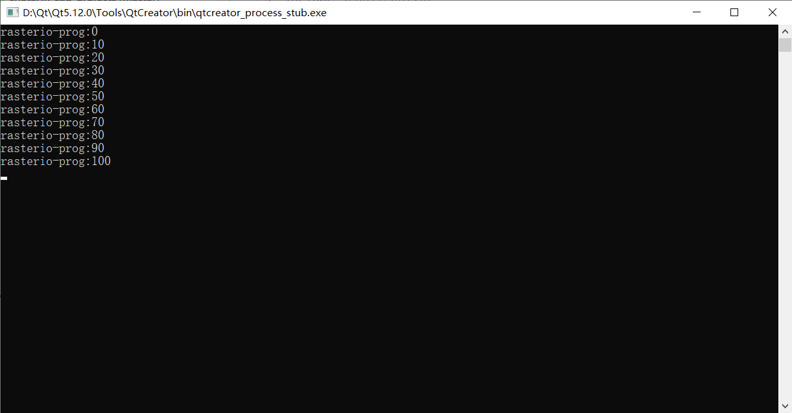

# GDAL进度条

gdal的进度条都是通过回调函数使用的。

使用方法为：

1. 根据三个形参（实际上只使用了第一个参数），编写一个返回值为int的函数，函数内使用形参输出相应的进程信息。

2. 把这个函数指针写入gdal的函数的指定位置完成。

以RasterIO为例：

首先写进度值返回函数：

```C++
int gdalprocess_tmp(double dfComplete,char * pszMessage,void * pProgressArg)
{
    int prog = static_cast<int>(dfComplete * 10);
    static int last_prog = -1;
    if(prog < last_prog){
        last_prog = -1;
    }
    if(last_prog < prog){
        printf("rasterio-prog:%d\n",prog * 10);
        last_prog = prog;
    }
    return true;
}
```

函数的输出格式为：每过10输出一次当前进度。

main：

```c++
#include <gdal/gdal_priv.h>
#include <gdal/gdal.h>

int main(int argc, char *argv[])
{
    GDALAllRegister();
    GDALDataset* pdataset = (GDALDataset*)GDALOpen("...",GA_ReadOnly);
    float* arr = new float[pdataset->GetRasterXSize() * pdataset->GetRasterYSize()];
    //定义GDALRasterIOExtraArg并初始化（初始化函数需要gdal.h）
	GDALRasterIOExtraArg ex_arg;
    INIT_RASTERIO_EXTRA_ARG(ex_arg);
	//这个是上面自己写的读进度值函数
    ex_arg.pfnProgress = (GDALProgressFunc)gdalprocess_tmp;
	//这个是gdal自带的读进度值函数，每过2.5%输出一个“.”，每过10%输出一次数字
//    ex_arg.pfnProgress = (GDALProgressFunc)GDALTermProgress;

    pdataset->GetRasterBand(1)->RasterIO(GF_Read, 0, 0, pdataset->GetRasterXSize(), pdataset->GetRasterYSize(), arr, pdataset->GetRasterXSize(), pdataset->GetRasterYSize(), GDT_Float32, 0, 0, &ex_arg);
    
    return 1;
}
```

结果如图所示


