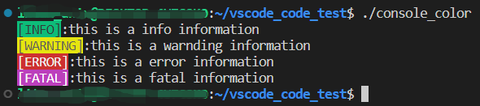

# 设置控制台输出颜色

windows, linux控制台打印彩色文字

## windows

### 颜色表


### code

输出颜色表的代码

```c++
#include <windows.h>
#include <iostream>

std::cout<<std::right;
for(int i=0; i<16; i++){
    for(int j=0; j<16; j++){
        int value = i * 16 + j;
        SetConsoleTextAttribute(GetStdHandle(STD_OUTPUT_HANDLE),value);
        std::cout<<setw(5)<<value;
    }
    std::cout<<std::endl;
}
```

### note

设置`SetConsoleTextAttribute`后，会影响所有的打印内容，如果要切回初始效果，只能选一个近似的值设置。黑底白字没有加量应该是`SetConsoleTextAttribute(GetStdHandle(STD_OUTPUT_HANDLE),7);`

windows.h与glog冲突，需要进行设置：

```c++
#define GLOG_NO_ABBREVIATED_SEVERITIES
#include <windows.h>
#include <glog/logging.h>
```

## linux

linux中就简单很多，不需要添加库，iostream即可

```c++
std::cout<<"\033[42m[INFO]\033[0m:"<<"this is a info information"<<std::endl;
std::cout<<"\033[43m[WARNING]\033[0m:"<<"this is a warnding information"<<std::endl;
std::cout<<"\033[41m[ERROR]\033[0m:"<<"this is a error information"<<std::endl;
std::cout<<"\033[45m[FATAL]\033[0m:"<<"this is a fatal information"<<std::endl;
```

效果如图所示：



`\033[?m`是linux中的指令，其中`?`部分是可以修改的值。

常见的设置为：

- `\033[0m` 关闭所有属性
- `\033[1m` 高亮
- `\033[2m` 亮度减半
- `\033[3m` 斜体
- `\033[4m` 下划线
- `\033[5m` 闪烁
- `\033[6m` 快闪
- `\033[7m` 反显
- `\033[8m` 消隐
- `\033[9m` 中间一道横线

10-19 关于字体的，21-29 基本与1-9正好相反

30-37 设置前景色

- `\033[30m` 黑
- `\033[31m` 红
- `\033[32m` 绿
- `\033[33m` 黄
- `\033[34m` 蓝
- `\033[35m` 紫
- `\033[36m` 深
- `\033[37m` 白

40-47 设置背景色

- `\033[40m` 黑色背景
- `\033[41m` 红色背景
- `\033[42m` 绿色背景
- `\033[43m` 棕色背景(黄)
- `\033[44m` 蓝色背景
- `\033[45m` 品红背景
- `\033[46m` 孔雀蓝背景
- `\033[47m` 白色背景
  
等等...后面还有很多但与颜色无关。

