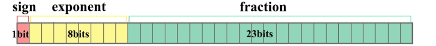
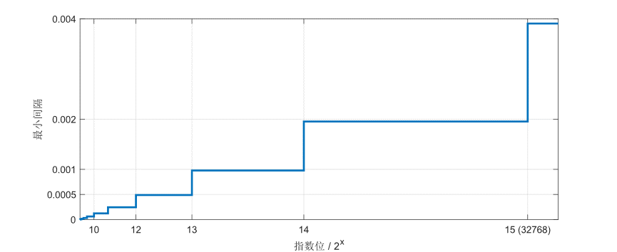
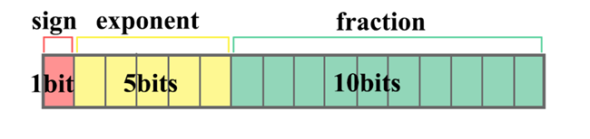
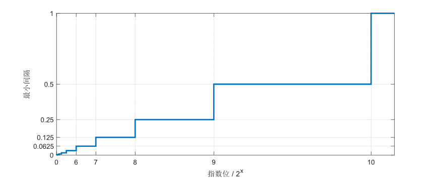

# float16与float32计算方式

## float32

float，单精度浮点数，用32比特(bits)/4字节(bytes)表示。为方便区分16位和32位float格式，之后称单精度float为float32，半精度float为float16。float32的比特组成如图所示。

- Sign：符号位，1bit，0代表正数，1代表负数。

- Exponent：指数位， 8bit，取值范围是$00000001 \sim 11111110$（00000000和11111111有特殊用途），转换成十进制为$1 \sim 254$，减去偏置值127得到最终范围是$-126 \sim 127$。

- Fraction：分数位，23bit，取值范围是$0 \sim 2^{23}$。

除去指数位全0或全1的特殊情况，常规情况下float32数值计算公式为：

$$
value = (-1)^{sign}*2^{exp-127}*(1+\frac{frac}{2^{23}})
$$

特殊情况：

1.当exponent全是0时，float32数值计算公式为：

$$
value = (-1)^{sign}*2^{-126}*(0+\frac{frac}{2^{23}})
$$

2.当exponent全是1时，如果fraction全是0，$value=inf$；如果fraction全是1，$value=NaN$。

举例：以0 10000100 01001110000000000001110为例，sign=0，exponent=132，fraction=2555918，该二进制数字代表的数值为:

$$
value = (-1)^0*2^{132-127}*(1+\frac{2555918}{2^{23}})=41.75005340576172
$$

float32和float16表示数的范围都是非均匀的，指数位越大，对应的最小间隔就越大。float32的最小间隔与指数位的关系为：$Interval_{Min}=2^{exp-127}/2^{23}$，最小间隔为$2^{-149}$，最大间隔为$2^{104}$。间隔变化图如下所示.

## float16

float16又称半精度浮点数，用16比特(bits)/2字节(bytes)表示。float16的比特组成如图所示。

Sign：符号位，1bit，0代表正数，1代表负数。
Exponent：指数位， 5bit，取值范围是$00001 \sim 11110$（00000和11111有特殊用途），转换成十进制为$1 \sim 30$，减去偏置值15得到最终范围是$-14 \sim 15$。
Fraction：分数位，10bit，取值范围是$0 \sim 2^{10}$。
除去指数位全0或全1的特殊情况，常规情况下float32数值计算公式为：

$$
value = (-1)^{sign}*2^{exp-15}*(1+\frac{fraction}{2^{10}})
$$

特殊情况：

1.当exponent全是0时，float16数值计算公式为：

$$
value = (-1)^{sign}*2^{-14}*(0+\frac{fraction}{2^{10}})
$$

2.当exponent全是1时，如果fraction全是0，$value=inf$；如果fraction全是1，$value=NaN$

举例：以0 10010 0101100010为例，sign=0，exponent=18，fraction=354，

$$
value=(-1)^0*2^{18-15}*(1+\frac{354}{2^{10}} )=10.765625
$$

float16表示数的范围都是非均匀的，指数位越大，对应的最小间隔就越大，最小间隔与指数位的关系为：$Interval_{Min}=2^{exp-15}*1/2^{10}$ ，最小间隔为${2^{-24}}$，最大间隔为$2^5$。间隔变化图如下所示。

可参考[IEEE 754浮点数](https://www.toolhelper.cn/Digit/FractionConvert)
