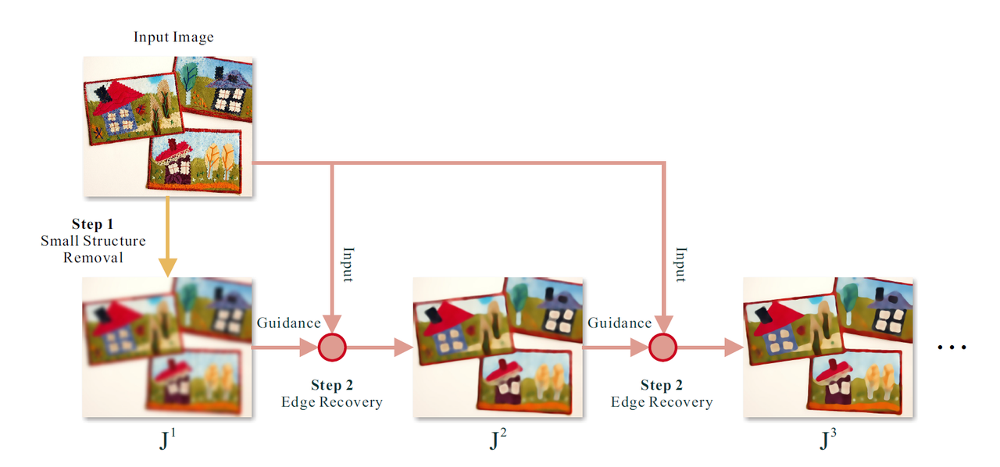

# 滤波

## 快速统计均值方差

统计影像的均值和方差时，常规做法是先循环一遍计算均值，再循环一遍计算方差，但通过推导方差计算公式，可以简化上述操作，缩短统计耗时。

```cpp
float mean = 0, std = 0;
for(int i=0; i < arr_size; i++){
    mean += arr[i];
    std += arr[i] * arr[i];
}
mean /= valid_num;
std = sqrtf(std / (valid_num-1) - valid_num / (valid_num-1) * mean * mean);
```

均值、方差的公式

$$
\begin{aligned}
\bar{x} =& \frac{1}{n}\sum x_i \\
    Std =& \sqrt{\frac{1}{n-1}\sum {(x_i - \bar{x})}^2} \\
        =& \sqrt{\frac{1}{n-1}(\sum{{x_i}^2}-n{\bar{x}}^2)}
\end{aligned}
$$

方差的推导过程，

$$
\begin{aligned}
&{Std}^2&=& \frac{1}{n-1}\sum {(x_i - \bar{x})}^2 \\
&       &=& \frac{1}{n-1}\sum ({x_i}^2 - 2\bar{x}\cdot x_i+{\bar{x}}^2) \\
&       &=& \frac{1}{n-1}(\sum {x_i}^2 - 2 \bar{x} \cdot \sum x_i  + n {\bar{x}}^2) \\
&       &=& \frac{1}{n-1}(\sum {x_i}^2 - 2 n {\bar{x}}^2  + n {\bar{x}}^2) \\
&       &=& \frac{1}{n-1}(\sum {x_i}^2 -  n {\bar{x}}^2) \\ \\

\Rarr & Std &=& \sqrt{\frac{1}{n-1}(\sum{{x_i}^2}-n{\bar{x}}^2)}
\end{aligned}
$$

## Rolling Guidance Filter



> Qi Zhang, Xiaoyong Shen, Li Xu, and Jiaya Jia, ‘Rolling Guidance Filter’, ECCV 2014, pp. 812–830, 2014.

### Step1: Small Structure Removal

$$
J_1(p)=\frac{1}{K_p}\displaystyle\sum_{q\in N(p)}\exp \bigg(-\frac{ {\|p-q\|}^2} {2\sigma_s^2}\bigg)I(q)
$$

$$
K_p=\displaystyle\sum_{q\in N(p)}{\exp \big(-\frac{ {\|p-q\|}^2} {2\sigma_s^2}\big)}
$$

其中， $p$是待求点， $q$是 $p$周围的所有点的集合， $I$是原图像， $\sigma_s^2$是标准偏差（ standard deviation）自己设定。通过这一步可以消除尺度小于 $\sigma_s^2$的结构。

（This filter completely removes structures whose scale is smaller than $\sigma_s^2$ as claimed in the scale space theory. It is implemented efficiently by separating kernels in perpendicular directions. Approximation by box filter is also feasible.）

### Step2: Edge Recovery

$$
J_{t+1}(p)=\frac{1}{K_p}\displaystyle\sum_{q\in N(p)}\exp \bigg(-\frac{ {\|p-q\|}^2}{2\sigma_s^2}-\frac{ {\|J_t(p)-J_t(q)\|}^2}{2\sigma_r^2}\bigg)I(q)
$$

$$
K_p=\displaystyle\sum_{q\in N(p)}\exp \bigg(-\frac{ {\|p-q\|}^2}{2\sigma_s^2}-\frac{ {\|J_t(p)-J_t(q)\|}^2}{2\sigma_r^2}\bigg)
$$

其中，$p$是待求点，$q$是 $p$周围的所有点的集合， $t=1,2,…,n$， $I$是原图像， $\sigma_s^2$和 $\sigma_r^2$分别控制时间权重和距离权重。

> $\sigma_s^2$ and $\sigma_r^2$ control the spatial and range weights respectively

## goldstein

经典的频谱滤波

> R. M. Goldstein and C. L. Werner, ‘Radar interferogram filtering for geophysical applications’, Geophysical Research Letters, vol. 25, no. 21, pp. 4035–4038, 1998, doi: 10.1029/1998GL900033

### formula

$$
H(u,v) = {S\{ \lvert Z(u,v)\rvert \}}^\alpha \cdot Z(u,v)
$$
