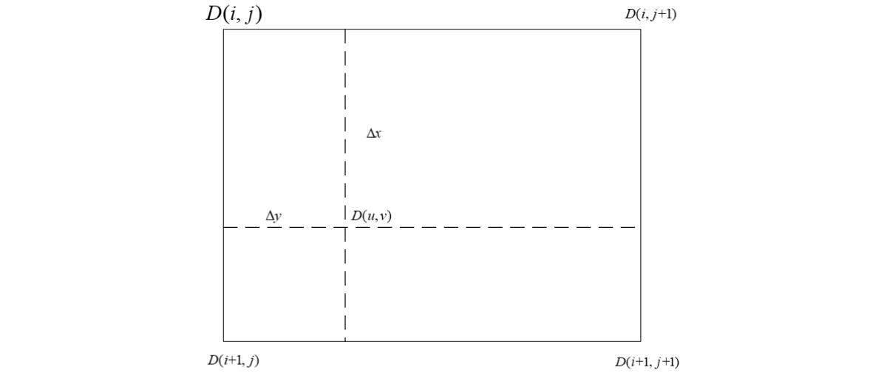
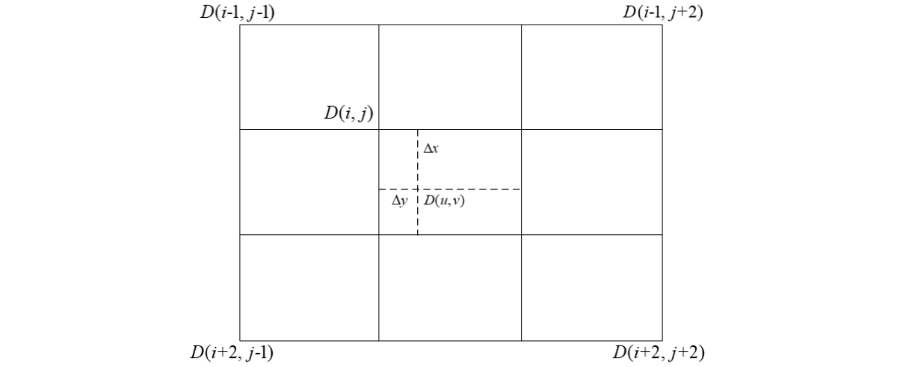

# 影像重采样

双线性插值、三次卷积

## 双线性内插法

适用于规则点的插值。取插值点周围4个最近像元点，如图所示。

四个像元点应分布在插值点四周，像元点之间间隔为1像素，内插点 $(u,v)$的灰度值 $D(u,v)$为：

$$
D(u,v)=[A][B][C]
$$

$$
A=
\begin{bmatrix}
\omega(\Delta x) & \omega(1-\Delta x) 
\end{bmatrix}
$$

$$
B=\begin{bmatrix}
    D(i,j)   &   D(i,j+1) \\
    D(i+1,j) & D(i+1,j+1)
\end{bmatrix}
$$

$$
C=\begin{bmatrix}
    \omega(\Delta y) \\
    \omega(1-\Delta y)
\end{bmatrix}
$$

$$
\omega(t)=\begin{cases}
    1-\lvert t \rvert &, 0\leqslant \lvert t \rvert \leqslant1 \\
     0 &, \:\:another
\end{cases}
$$

整理得到，
$$
D(u,v)=
\begin{bmatrix}
    1- \Delta x  &  \Delta x 
\end{bmatrix}
\begin{bmatrix}
    D(i,j)   &   D(i,j+1) \\
    D(i+1,j) & D(i+1,j+1)
\end{bmatrix}
\begin{bmatrix}
    1- \Delta y  \\
     \Delta y 
\end{bmatrix}
,0\leqslant   \Delta x,\Delta y  \leqslant1
$$

## 三次卷积插值

取插值点周围16个像元点，像元点间隔为1，如图所示。

16个像元点应分布在插值点四周，像元点之间间隔为1像素，内插点 $(u,v)$的灰度值 $D(u,v)$
为：

$$
D(u,v)=[A][B][C]
$$

$$
A=\begin{bmatrix}
    \omega(1+\Delta x) & \omega(\Delta x) & \omega(1-\Delta x) & \omega(2-\Delta x)
\end{bmatrix}
$$

$$
B=\begin{bmatrix}
    D(i-1,j-1) & D(i-1,j) & D(i-1,j+1) & D(i-1,j+2) \\
    D( i ,j-1) & D( i ,j) & D( i ,j+1) & D( i ,j+2) \\
    D(i+1,j-1) & D(i+1,j) & D(i+1,j+1) & D(i+1,j+2) \\
    D(i+2,j-1) & D(i+2,j) & D(i+2,j+1) & D(i+2,j+2) \\
\end{bmatrix}
$$

$$
C=\begin{bmatrix}
    \omega(1+\Delta y) \\
    \omega(\Delta y) \\
    \omega(1-\Delta y) \\
    \omega(2-\Delta y)
\end{bmatrix}
$$

$$
\omega(t)=\begin{cases}
    1-2{\lvert t\rvert}^2+{\lvert t\rvert}^3&,0 \leqslant \lvert t\rvert <1 \\
    4-8\lvert t\rvert+5{\lvert t\rvert}^2-{\lvert t\rvert}^3&,1 \leqslant \lvert t\rvert <2 \\
    0 &,\lvert t\rvert \geqslant 2
\end{cases}
$$
