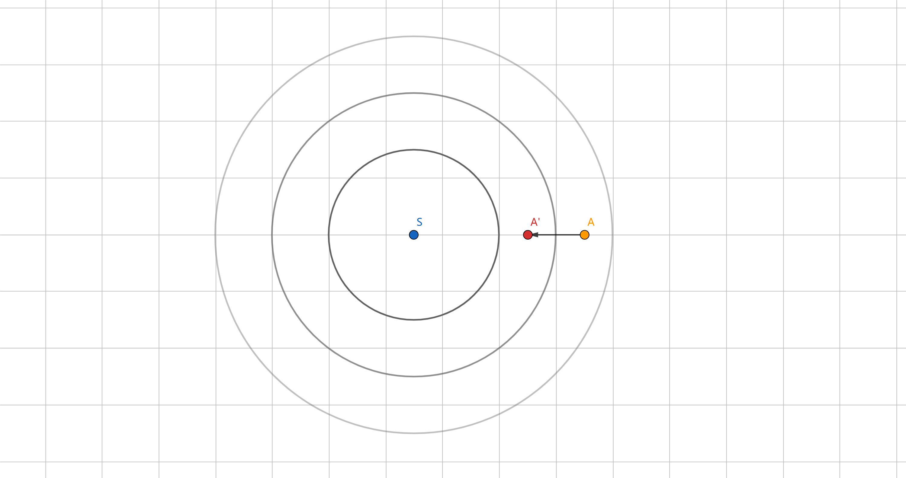
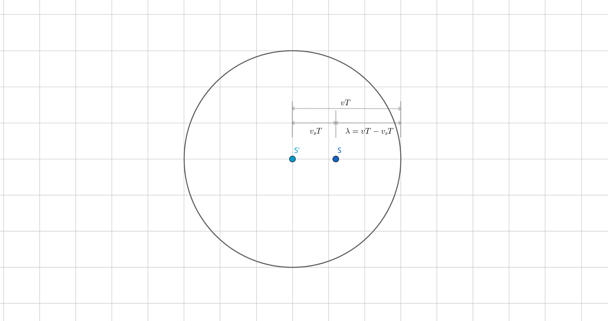
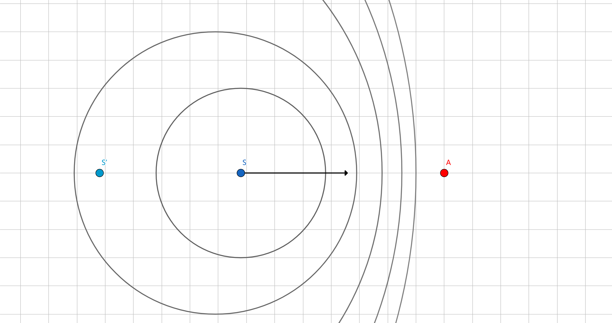

# 距离-多普勒模型

R-D模型公式推导

## 公式总览

$$
\begin{align}
    {Rj}^2 =& (\vec{R_S}-\vec{R_T})^2   \\
    f_d    =& \frac{2}{\lambda}\frac{(\vec{R_S}-\vec{R_T})V_S}{\lvert\vec{R_S}-\vec{R_T} \rvert}
\end{align}
$$

式中， $R_j$为卫星, $S$到地物点, $T$的斜距, $R_S$是卫星的位置矢量, $R_T$是地物点的位置矢量。

## 公式推导

### 距离方程

### 多普勒方程

对于SAR，整个过程分为两个阶段

1. 卫星发出信号，地物接收
    >视SAR为声源，地物为观察者。
    >声源向着观察者方向移动，观察者不动。
2. 地物反射信号，卫星接收
    >视地物为声源，SAR为观察者。
    >声源不动，观察者移动。

设SAR发射的电磁波频率为 $f_0$，1.中地物接收的频率为 $f'$，2.中卫星接收的频率为 $f$，则有

$$
\begin{align}
    f'=& \frac{c}{c-w'}f_0 \\
    f =& \frac{c+w'}{c}f'
\end{align}
$$

其中， $c$为光速， $w'=w\cos\psi$， $w$为卫星速度矢量， $\psi$为方位角。

公式原理参考[多普勒效应](#多普勒效应)。

所以，多普勒频移

$$
\begin{aligned}
    \Delta f =& f - f_0 \\
             =& (\frac{c+w'}{c-w'}-1)f_0 \\
             =& \frac{2w'}{c-w'}f_0 \\
       \approx&  \frac{2w'}{\lambda} = \frac{2}{\lambda}\cdot \frac{dR}{dt}
\end{aligned}
$$

其中， $w'$为 $w$在 $\overrightarrow{TS}$方向的分量， $R=(X_S-X_T,Y_S-Y_T,Z_S-Z_T)\cdot(\pm1)$

$$
\begin{aligned}
    w'= \frac{dR}{dt}
    =& \pm d\sqrt{(X_S-X_T)^2+(Y_S-Y_T)^2+(Z_S-Z_T)^2}/dt \\
    =& \pm \frac{(X_S-X_T)(V_{SX}-V_{TX})+(Y_S-Y_T)(V_{SY}-V_{TY})+(Z_S-Z_T)(V_{SZ}-V_{TZ})}{\sqrt{(X_S-X_T)^2+(Y_S-Y_T)^2+(Z_S-Z_T)^2}} \\
    \because V_t =& 0 \\
    \therefore w'
    =& \frac{dR}{dt}
    = \pm \frac{(\vec{R_S}-\vec{R_T})\vec{V_S}}{\lvert \vec{R_S}-\vec{R_T} \rvert}
\end{aligned}
$$

综上所述,

$$
\begin{align}
    \Delta f = \frac{2}{\lambda}\frac{(\vec{R_S}-\vec{R_T})\vec{V_S}}{\lvert \vec{R_S}-\vec{R_T} \rvert}
\end{align}
$$

## 多普勒效应

多普勒效应是RD模型中，多普勒方程的基础。

观察者 $A$，声源 $S$. 观察者移动速度为 $v_A$，声源移动速度为 $v_S$，波的速度和频率分别为 $v$和 $f$。

### 1.观察者移动，声源不动

当 $A$移动到 $A'$时，走过距离 $v_At$，声传播距离 $vt$.

所以， $A$经历的波数 $N$等于 $(v_A+v)t$除以波长 $\lambda$，即

$$
N=\dfrac{v_At+vt}{\lambda}
$$

波数 $N$除以时间 $t$，即为单位时间的波数，等效为频率

$$
\begin{aligned}
f'=& \frac{v_At+vt}{\lambda t}\\
=& \frac{v_A+v}{\lambda } \\
=& \frac{v+v_A}{v}f > f
\end{aligned}
$$

由上可知，当观察者 $A$向波源 $S$移动时，接收到的频率 $f'$**大于**波源发出的频率 $f$。反之，逃离时则**小于**。

### 2.声源移动，观察者不动

已知 $f=\dfrac{1}{T}$， $T$为发射一个波所需要的时间， $T$时间内，博得传播速度为 $vT$，波源的移动距离为 $v_ST$. 此时，波源 $S$到波的距离即为波长,

$$
\lambda = vT-v_ST
$$

认为当波源 $S$向观察者 $A$移动时，波长 $\lambda$缩短。

以观察者接受到声波为起始时间，共精力时间 $t$，此时波的传播距离为 $vt$，除以波长得到波数（ $A$接收到波的个数）

$$
N'=\frac{vt}{\lambda}=\frac{vt}{vT-v_ST}=\frac{vt}{v-v_S}f
$$

波数 $N'$除以时间 $t$，即为单位时间接收到的声波个数，等效为频率

$$
f'=\frac{\frac{vt}{v-v_S}f}{t}=\frac{v}{v-v_S}f > f
$$

所以，当声源向观察者移动时（ $v_S>0$），接收到的频率 $f'$**大于**波源的发出频率 $f$，反之则**小于**。

## 零化处理的猜想

根据多普勒效应可知，

卫星发射信号阶段，如果卫星向地物方向移动，会导致地物接收的信号频率大于卫星发射频率，即$f'>f_0$,

卫星接收反射信号阶段，如果卫星原理地物，会导致卫星接收的信号频率小于地物反射频率，即$f>f'$,

已知卫星在某时刻的速度矢量为$\vec{V_S}$, 卫星发射信号时面向地物方向运动，接收信号时远离地物方向运动，此时卫星发射$f$与接收$f_0$的信号频率关系为,

$$
\begin{aligned}
    f   =& \frac{c}{c-w'}f' \\
        =& \frac{c}{c-w'} \cdot \frac{c+(-w')}{c} f_0 \\
        =& f_0 \\
\end{aligned}
$$

式中，$w'$为速度矢量的模 $\lvert \vec{V_S} \rvert$。

所以，这种情况下，多普勒频移$\Delta f = 0$, 即为零化多普勒处理。

（猜想...）
