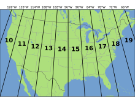
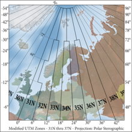
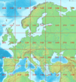
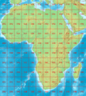
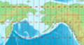

# UTM to WGS84 BLH

copy from [Universal Transverse Mercator coordinate system](https://en.wikipedia.org/wiki/Universal_Transverse_Mercator_coordinate_system)

## History

The [National Oceanic and Atmospheric Administration](https://en.wikipedia.org/wiki/National_Oceanic_and_Atmospheric_Administration) (NOAA) website states the system to have been developed by the [United States Army Corps of Engineers](https://en.wikipedia.org/wiki/United_States_Army_Corps_of_Engineers), starting in the early 1940s.[[2](https://en.wikipedia.org/wiki/Universal_Transverse_Mercator_coordinate_system#cite_note-3) However, a series of aerial photos found in the Bundesarchiv-Militärarchiv (the military section of the [German Federal Archives](https://en.wikipedia.org/wiki/German_Federal_Archives)) apparently dating from 1943–1944 bear the inscription UTMREF followed by grid letters and digits, and projected according to the transverse Mercator,[[3](https://en.wikipedia.org/wiki/Universal_Transverse_Mercator_coordinate_system#cite_note-Buchroithner-4) a finding that would indicate that something called the UTM Reference system was developed in the 1942–43 time frame by the [Wehrmacht](https://en.wikipedia.org/wiki/Wehrmacht). It was probably carried out by the Abteilung für Luftbildwesen (Department for Aerial Photography). From 1947 onward the US Army employed a very similar system, but with the now-standard 0.9996 scale factor at the central meridian as opposed to the German 1.0.[[4](https://en.wikipedia.org/wiki/Universal_Transverse_Mercator_coordinate_system#cite_note-Buchroithner-4) For areas within the [contiguous United States](https://en.wikipedia.org/wiki/Contiguous_United_States) the [Clarke](https://en.wikipedia.org/wiki/Alexander_Ross_Clarke) [Ellipsoid](https://en.wikipedia.org/wiki/Earth_ellipsoid#Historical_Earth_ellipsoids) of 1866[[5](https://en.wikipedia.org/wiki/Universal_Transverse_Mercator_coordinate_system#cite_note-5) was used. For the remaining areas of Earth, including [Hawaii](https://en.wikipedia.org/wiki/Hawaii), the [International Ellipsoid](https://en.wikipedia.org/wiki/International_Ellipsoid)[[6](https://en.wikipedia.org/wiki/Universal_Transverse_Mercator_coordinate_system#cite_note-6) was used. The [World Geodetic System](https://en.wikipedia.org/wiki/World_Geodetic_System) WGS84 ellipsoid is now generally used to model the Earth in the UTM coordinate system, which means current UTM northing at a given point can differ up to 200 meters from the old. For different geographic regions, other datum systems can be used.

Prior to the development of the Universal Transverse Mercator coordinate system, several European nations demonstrated the utility of grid-based conformal maps by mapping their territory during the [interwar period](https://en.wikipedia.org/wiki/Interwar_period). Calculating the distance between two points on these maps could be performed more easily in the field (using the [Pythagorean theorem](https://en.wikipedia.org/wiki/Pythagorean_theorem)) than was possible using the trigonometric formulas required under the graticule-based system of [latitude and longitude](https://en.wikipedia.org/wiki/Geographic_coordinate_system). In the post-war years, these concepts were extended into the Universal Transverse Mercator/[Universal Polar Stereographic](https://en.wikipedia.org/wiki/Universal_Polar_Stereographic) (UTM/UPS) coordinate system, which is a global (or universal) system of grid-based maps.

The transverse Mercator projection is a variant of the [Mercator projection](https://en.wikipedia.org/wiki/Mercator_projection), which was originally developed by the [Flemish](https://en.wikipedia.org/wiki/Flemish_people) geographer and cartographer [Gerardus Mercator](https://en.wikipedia.org/wiki/Gerardus_Mercator), in 1570. This projection is [conformal](https://en.wikipedia.org/wiki/Conformal_map_projection#Conformal), which means it preserves angles and therefore shapes across small regions. However, it distorts distance and area.

Definitions[[edit](https://en.wikipedia.org/w/index.php?title=Universal_Transverse_Mercator_coordinate_system&action=edit&section=2)]

### UTM zone

[[edit](https://en.wikipedia.org/w/index.php?title=Universal_Transverse_Mercator_coordinate_system&action=edit&section=3)

Simplified view of [contiguous US](https://en.wikipedia.org/wiki/Contiguous_United_States) UTM zones, projected with Lambert conformal conic.

The UTM system divides the Earth into 60 zones, each 6° of longitude in width. Zone 1 covers longitude 180° to 174° W; zone numbering increases eastward to zone 60, which covers longitude 174°E to 180°. The polar regions south of [80°S](https://en.wikipedia.org/wiki/80th_parallel_south) and north of [84°N](https://en.wikipedia.org/wiki/84th_parallel_north) are excluded.

Each of the 60 zones uses a [transverse Mercator](https://en.wikipedia.org/wiki/Transverse_Mercator) projection that can map a region of large north-south extent with low distortion. By using narrow zones of 6° of longitude (up to 668 km) in width, and reducing the [scale](https://en.wikipedia.org/wiki/Scale_(map)) factor along the central [meridian](https://en.wikipedia.org/wiki/Meridian_(geography)) to 0.9996 (a reduction of 1:2500), the amount of distortion is held below 1 part in 1,000 inside each zone. Distortion of scale increases to 1.0010 at the zone boundaries along the [equator](https://en.wikipedia.org/wiki/Equator).

In each zone the scale factor of the central meridian reduces the diameter of the transverse cylinder to produce a secant projection with two [standard lines](https://en.wikipedia.org/wiki/Standard_line), or lines of true scale, about 180 km on each side of, and about parallel to, the central meridian (Arc cos 0.9996 = 1.62° at the Equator). The scale is less than 1 inside the standard lines and greater than 1 outside them, but the overall distortion is minimized.

### Overlapping grids

[[edit](https://en.wikipedia.org/w/index.php?title=Universal_Transverse_Mercator_coordinate_system&action=edit&section=4)

Universal Transverse Mercator (UTM) Grid Zones 31N thru 37N differ from the standard 6° wide by 84° zone for the northern hemisphere, in part to accommodate the southern half of the Kingdom of Norway. For more on its history, see Clifford J. Mugnier's article on Grids & Datums of The Kingdom of Norway that appeared in the October 1999 issue of PE&RS http://www.asprs.org/a/resources/grids/10-99-norway.pdf

Distortion of scale increases in each UTM zone as the boundaries between the UTM zones are approached. However, it is often convenient or necessary to measure a series of locations on a single grid when some are located in two adjacent zones. Around the boundaries of large scale maps (1:100,000 or larger) coordinates for both adjoining UTM zones are usually printed within a minimum distance of 40 km on either side of a zone boundary. Ideally, the coordinates of each position should be measured on the grid for the zone in which they are located, but because the scale factor is still relatively small near zone boundaries, it is possible to overlap measurements into an adjoining zone for some distance when necessary.

Latitude bands[[edit](https://en.wikipedia.org/w/index.php?title=Universal_Transverse_Mercator_coordinate_system&action=edit&section=5)

Latitude bands are not a part of UTM, but rather a part of the [military grid reference system](https://en.wikipedia.org/wiki/Military_grid_reference_system) (MGRS).[[7](https://en.wikipedia.org/wiki/Universal_Transverse_Mercator_coordinate_system#cite_note-7) They are however sometimes used.

### Latitude bands

[[edit](https://en.wikipedia.org/w/index.php?title=Universal_Transverse_Mercator_coordinate_system&action=edit&section=6)

Each zone is segmented into 20 latitude bands. Each latitude band is 8 degrees high, and is lettered starting from "C" at [80°S](https://en.wikipedia.org/wiki/80th_parallel_south), increasing up the [English](https://en.wikipedia.org/wiki/English_language) [alphabet](https://en.wikipedia.org/wiki/Alphabet) until "X", omitting the letters "I" and "O" (because of their similarity to the numerals one and zero). The last latitude band, "X", is extended an extra 4 degrees, so it ends at [84°N latitude](https://en.wikipedia.org/wiki/84th_parallel_north), thus covering the northernmost land on Earth.

Latitude bands "A" and "B" do exist, as do bands "Y" and "Z". They cover the western and eastern sides of the Antarctic and Arctic regions respectively. A convenient [mnemonic](https://en.wikipedia.org/wiki/Mnemonic) to remember is that the letter "N" is the first letter in "northern hemisphere", so any letter coming before "N" in the alphabet is in the southern hemisphere, and any letter "N" or after is in the northern hemisphere.

### Notation

[[edit](https://en.wikipedia.org/w/index.php?title=Universal_Transverse_Mercator_coordinate_system&action=edit&section=7)

The combination of a zone and a latitude band defines a grid zone. The zone is always written first, followed by the latitude band. For example, (see image, top right), a position in [Toronto, Ontario](https://en.wikipedia.org/wiki/Toronto,_Ontario), [Canada](https://en.wikipedia.org/wiki/Canada), would find itself in zone 17 and latitude band "T", thus the full grid zone reference is "17T". The grid zones serve to delineate irregular UTM zone boundaries. They also are an integral part of the [military grid reference system](https://en.wikipedia.org/wiki/Military_grid_reference_system).

A note of caution: A method also is used that simply adds N or S following the zone number to indicate North or South hemisphere (the easting and northing coordinates along with the zone number supplying everything necessary to geolocate a position except which hemisphere). However, this method has caused some confusion since, for instance, "50S" can mean southern hemisphere but also *grid zone* "50S" in the northern hemisphere.[[8](https://en.wikipedia.org/wiki/Universal_Transverse_Mercator_coordinate_system#cite_note-8) There are many possible ways to disambiguate between the two methods, two of which are demonstrated later in this article.

### Exceptions

[[edit](https://en.wikipedia.org/w/index.php?title=Universal_Transverse_Mercator_coordinate_system&action=edit&section=8)

These grid zones are uniform over the globe, except in two areas. On the southwest coast of [Norway](https://en.wikipedia.org/wiki/Norway), grid zone 32V (9° of longitude in width) is extended further west, and grid zone 31V (3° of longitude in width) is correspondingly shrunk to cover only open water. Also, in the region around [Svalbard](https://en.wikipedia.org/wiki/Svalbard), the four grid zones 31X (9° of longitude in width), 33X (12° of longitude in width), 35X (12° of longitude in width), and 37X (9° of longitude in width) are extended to cover what would otherwise have been covered by the seven grid zones 31X to 37X. The three grid zones 32X, 34X and 36X are not used.

### Grid zones in various parts of the world

Europe

Africa 

South America 

Bering Sea with Alaska

Locating a position using UTM coordinates [[edit](https://en.wikipedia.org/w/index.php?title=Universal_Transverse_Mercator_coordinate_system&action=edit&section=9)

A position on the Earth is given by the UTM zone number and the [easting and northing](https://en.wikipedia.org/wiki/Easting_and_northing) planar coordinate pair in that zone. The [point of origin](https://en.wikipedia.org/wiki/Origin_(mathematics)) of each UTM zone is the intersection of the equator and the zone's central meridian. To avoid dealing with negative numbers, the central meridian of each zone is defined to coincide with 500000 meters East. In any zone a point that has an easting of 400000 meters is about 100 km west of the central meridian. For most such points, the true distance would be slightly more than 100 km as measured on the surface of the Earth because of the distortion of the projection. UTM eastings range from about 167000 meters to 833000 meters at the equator.

In the northern hemisphere positions are measured northward from zero at the equator. The maximum "northing" value is about 9300000 meters at latitude 84 degrees North, the north end of the UTM zones. In the southern hemisphere northings decrease southward from the equator, set at 10000000 meters, to about 1100000 meters at 80 degrees South, the south end of the UTM zones. For the southern hemisphere, its northing at the equator is set at 10000000 meters so no point has a negative northing value.

The [CN Tower](https://en.wikipedia.org/wiki/CN_Tower) is at [43°38′33.24″N 79°23′13.7″W](https://tools.wmflabs.org/geohack/geohack.php?pagename=Universal_Transverse_Mercator_coordinate_system&params=43_38_33.24_N_79_23_13.7_W_&title=CN+Tower), which is in UTM zone 17, and the grid position is 630084 m east, 4833438 m north. Two points in Zone 17 have these coordinates, one in the northern hemisphere and one in the south; one of two conventions is used to say which:

1. Append a hemisphere designator to the zone number, "N" or "S", thus "17N 630084 4833438". This supplies the minimum information to define the position uniquely.
2. Supply the grid zone, i.e., the latitude band designator appended to the zone number, thus "17T 630084 4833438". The provision of the latitude band along with northing supplies redundant information (which may, as a consequence, be contradictory if misused).

Because latitude band "S" is in the northern hemisphere, a designation such as "38S" is unclear. The "S" might refer to the latitude band ([32°N](https://en.wikipedia.org/wiki/32nd_parallel_north)–[40°N](https://en.wikipedia.org/wiki/40th_parallel_north)) or it might mean "South". It is therefore important to specify which convention is being used, e.g., by spelling out the hemisphere, "North" or "South", or using different symbols, such as − for south and + for north.

### Simplified formulae

[[edit](https://en.wikipedia.org/w/index.php?title=Universal_Transverse_Mercator_coordinate_system&action=edit&section=10)]

These formulae are truncated version of [Transverse Mercator: flattening series](https://en.wikipedia.org/w/index.php?title=Transverse_Mercator:_flattening_series&action=edit&redlink=1), which were originally derived by [Johann Heinrich Louis Krüger](https://en.wikipedia.org/wiki/Johann_Heinrich_Louis_Krüger) in 1912.[[9](https://en.wikipedia.org/wiki/Universal_Transverse_Mercator_coordinate_system#cite_note-kruger-9) They are accurate to around a [millimeter](https://en.wikipedia.org/wiki/Millimeter) within 3,000 km of the central meridian.[[10](https://en.wikipedia.org/wiki/Universal_Transverse_Mercator_coordinate_system#cite_note-karney-10) Concise commentaries for their derivation have also been given.[[11](https://en.wikipedia.org/wiki/Universal_Transverse_Mercator_coordinate_system#cite_note-kawase2012-11)[[12](https://en.wikipedia.org/wiki/Universal_Transverse_Mercator_coordinate_system#cite_note-kawase2011-12)

The [WGS 84](https://en.wikipedia.org/wiki/WGS_84) [spatial reference system](https://en.wikipedia.org/wiki/Spatial_reference_system) describes Earth as an [oblate spheroid](https://en.wikipedia.org/wiki/Oblate_spheroid) along north-south axis with an [equatorial radius](https://en.wikipedia.org/wiki/Equatorial_radius) of $a=6378.137$ km and an inverse [flattening](https://en.wikipedia.org/wiki/Flattening) of $1/f=298.257 223 563$. Let's take a point of latitude  $\varphi$ and of longitude $\lambda$ and compute its UTM coordinates as well as [point scale factor](https://en.wikipedia.org/wiki/Transverse_Mercator_projection#Point_scale) $k$ and [meridian convergence](https://en.wikipedia.org/wiki/Transverse_Mercator_projection#Convergence) $\gamma$ using a reference meridian of longitude . By convention, in the [northern hemisphere](https://en.wikipedia.org/wiki/Northern_hemisphere) $N_0=0$ km and in the [southern hemisphere](https://en.wikipedia.org/wiki/Southern_hemisphere) $N_0=10000km$. By convention also $k_0=0.9996$ and $E_0=500km$.

In the following formulas, the distances are in [kilometers](https://en.wikipedia.org/wiki/Kilometer). In advance, let's compute some preliminary values:

$$n=\frac{f}{2-f}, A=\frac{a}{1+n}\big(1+\frac{n^2}{4}+\frac{n^4}{64}+\cdots\big), $$

$$ \alpha_1=\frac{1}{2}n-\frac{2}{3}n^2+\frac{5}{16}n^3,\alpha_2=\frac{13}{48}n^2-\frac{3}{5}n^3, \alpha_3=\frac{61}{240}n^3,$$

$$   \beta_1=\frac{1}{2}n-\frac{2}{3}n^2+\frac{37}{96}n^3,\beta_2=\frac{1}{48}n^2+\frac{1}{15}n^3,\beta_3=\frac{17}{480}n^3, $$

$$  \delta_1=2n-\frac{2}{3}n^2-2n^3,\delta_2=\frac{7}{3}n^2-\frac{8}{5}n^3,\delta_3=\frac{56}{15}n^3.$$

### From latitude, longitude (*φ*,*λ*) to UTM coordinates (E, N)

[[edit](https://en.wikipedia.org/w/index.php?title=Universal_Transverse_Mercator_coordinate_system&action=edit&section=11)

First let's compute some intermediate values:

$$ t=\sinh\big(\tanh^{-1}\sin\varphi-\frac{2\sqrt{n}}{1+n}tanh^{-1}(\frac{2\sqrt{n}}{1+n}\sin\varphi) \big),$$

$$\xi^\prime=\tan^{-1}\big(\frac{t}{\cos(\lambda-\lambda_0)}\big),\eta^\prime=\tanh^{-1}\big(\frac{\sin(\lambda-\lambda_0)}{\sqrt{1+t^2}}\big),$$

$$\sigma=1+\displaystyle\sum_{j=1}^3{2j\alpha_j\cos(2j\xi^\prime)\cosh(2j\eta^\prime)},\tau=\displaystyle\sum_{j=1}^3{2j\alpha_j\sin(2j\xi^\prime)\sinh(2j\eta^\prime)}$$

The final formulae are:

$$E=E_0+k_0A\bigg(\eta^\prime+\displaystyle\sum_{j=1}^3{\alpha_j\cos(2j\xi^\prime)\sinh(2j\eta^\prime)}\bigg)$$

$$N=N_0+k_0A\bigg(\xi^\prime+\displaystyle\sum_{j=1}^3{\alpha_j\sin(2j\xi^\prime)\cosh(2j\eta^\prime)}\bigg)$$

$$k=\frac{k_0A}{a}\sqrt{\{1+\bigg(\frac{1-n}{1+n}\tan\varphi\bigg)^2\}\frac{\sigma^2+\tau^2}{t^2+\cos^2(\lambda-\lambda_0)}},$$

$$\gamma=\tan^{-1}\bigg(\frac{\tau\sqrt{1+t^2}+\sigma t\tan(\lambda-\lambda_0)}{\sigma\sqrt{1+t^2}-\tau t\tan(\lambda-\lambda_0)}\bigg)$$

**From UTM coordinates (E, N, Zone, Hemi) to latitude, longitude (φ, λ)**[[edit](https://en.wikipedia.org/w/index.php?title=Universal_Transverse_Mercator_coordinate_system&action=edit&section=12)

Note: Hemi=+1 for Northern, Hemi=-1 for Southern

First let's compute some intermediate values:

$$\xi=\frac{N-N_0}{k_0A},\eta=\frac{E-E_0}{k_0A},$$

$$\xi^\prime=\xi-\displaystyle\sum_{j=1}^3{\beta_j\sin(2j\xi)\cosh(2j\eta)},\eta^\prime=\eta-\displaystyle\sum_{j=1}^3{\beta_j\cos(2j\xi)\sinh(2j\eta)},$$

$$\sigma^\prime=1-\displaystyle\sum_{j=1}^3{2j\beta_j\cos(2j\xi)\cosh(2j\eta)},\tau^\prime=\displaystyle\sum_{j=1}^3{2j\beta_j\sin(2j\xi)\sinh(2j\eta)},$$

$$\chi=\sin^{-1}\big(\frac{\sin\xi^\prime}{\cosh\eta^\prime}\big).$$

The final formulae are:

$$\varphi = \chi+\displaystyle\sum_{j=1}^3{\sigma_j\sin(2j\chi)},$$

$$\lambda_0=Zone\ast6\degree-183\degree$$

$$\lambda=\lambda_0+\tan^{-1}\big(\frac{\sinh\eta^\prime}{\cos\xi^\prime}\big)$$

$$k=\frac{k_0A}{a}\sqrt{\{1+{(\frac{1-n}{1+n}\tan\varphi)}^2\}\frac{\cos^2\xi^\prime+\sinh^2\eta^\prime}{ {\sigma^\prime}^2+{\tau^\prime}^2}},$$

$$\gamma=Hemi*\tan^{-1}\big(\frac{\tau^\prime+\sigma^\prime \tan\xi^\prime\tanh\eta^\prime}{\sigma^\prime-\tau^\prime\tan\xi^\prime\tanh\eta^\prime}\big)$$
