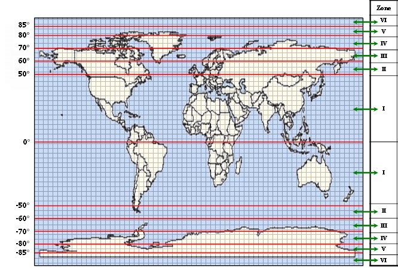

# TanDEM-X 90m DEM下载

官方提供的数据下载方法有三种，我使用的是FTP代理下载。

详细说明见 [The TanDEM-X 90m Digital Elevation Model](https://geoservice.dlr.de/web/dataguide/tdm90/)

## 数据基本情况

The pixel spacing for the TanDEM-X 90m DEM product in latitude direction towards the poles is constant at 3 arcsec, but the pixel spacing in longitudinal directions is not. Instead 6 different zones with different longitudinal pixel spacing ranging from 3 arcsec to 30arcsec are defined for both the Northern and Southern hemisphere. In a metric scale the latitude pixel spacing varies only slightly due to the ellipsoid flattening between 92.78m at the equator and 92.50m at the pole, while for the longitudinal pixel spacing larger differences are present.

Zone | Latitude Zone Extension |Latitude Pixel Spacing [arsec] |Longitude Pixel Spacing [arsec]
:---:|:---:|:---:|:---:
V|80° - 85° N|3.0" (93m)|15.0" (81.0m...31m)
IV|70° - 80° N|3.0" (93m)|9.0" (94.5m...48m)
III|60° - 70° N|3.0" (93m)| 6.0" (93.0m...63m)
II|50° - 60° N|3.0" (93m)| 4.5" (90.0m...69m)
I|  0° - 50° N|3.0" (93m)| 3.0" (93.0m...60m)
|||Equator|
I|  0° - 50° S|3.0" (93m)| 3.0" (93.0m...60m)
II|50° - 60° S|3.0" (93m)| 4.5" (90.0m...69m)
III|60° - 70° S|3.0" (93m)| 6.0" (93.0m...63m)
IV|70° - 80° S|3.0" (93m)|9.0" (94.5m...48m)
V|80° - 85° S|3.0" (93m)|15.0" (81.0m...31m)
 VI|85° - 88° S  88° - 89° S  89° - 90° S|3.0" (93m)  3.0" (93m)  3.0" (93m)|30.0" (81.0m...24m)  30.0" (23.5m.....8m)  30.0" (..8.1m.....0m)
|||South Pole|

对于中国大部分区域, TanDEM-X_90m_DEM产品的经度分辨率为3"(93m), 纬度分辨率为3.0" (93.0m...60m)。

## 数据下载

TanDEM-x 90m 数据需要注册账户才可以下载，下载流程如下：

1. 注册账户, [https://sso.eoc.dlr.de/tdm90/selfservice/](https://sso.eoc.dlr.de/tdm90/selfservice/)（按照流程填写信息注册账户即可）；
2. 下载"FileZilla"软件（官方介绍时使用的软件，其实使用其他FTP工具也可）；
3. 打开软件的站点管理器，新增站点，其中：
   - 协议：FTP
   - 主机：tandemx-90m.dlr.de
   - 端口：21
   - 加密：显式的 FTP over TLS
   - 用户：注册时地用户名，而非邮箱
   - 密码：注册时使用的密码
   - 传输模式：被动（对于FileZilla软件，该设置位于“传输设置中”）
  
4.点击“连接”按钮，等待FTP成功连接（如果失败请逐项排查问题）
5.下载TanDEM数据
