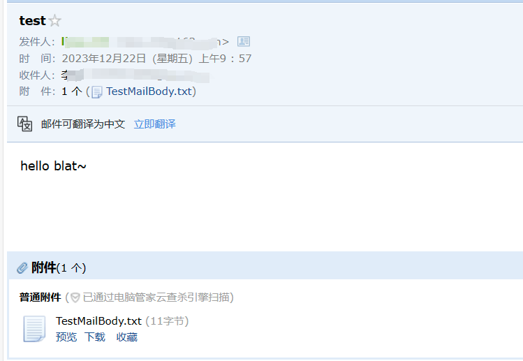

# blat 自动发邮件

[blat](http://www.blat.net/)是一个可以发送邮件的小工具, 但好像会被很多杀毒软件识别为“木马”（360），或“广告”（腾讯）...

## 初次使用

### bat

```bat
cd /d C:\Users\Administrator\Desktop\blat3219\full

blat -install smtp.163.com send@email.com

blat TestMailBody.txt -to receive@email.com -u send@email.com -pw password -subject 邮件主题 -attach TestMailBody.txt
```

TestMailBody.txt文件内的内容：

“hello blat~”

### 说明

第一个“TestMailBody.txt”是发送邮件的主要内容

-to 接收方的邮箱号

-u 发送方的邮箱号

-pw 发送方的smtp授权码，不是账号密码

-subject 邮件主题

-attach 附件

### 接收示例



## 异常提醒

由于工作需要，需要在一台非本地设备中执行一个自动化脚本，搭配blat可以实现异常报错
