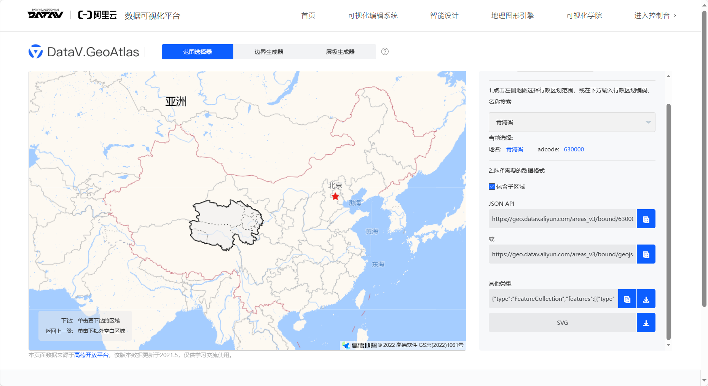
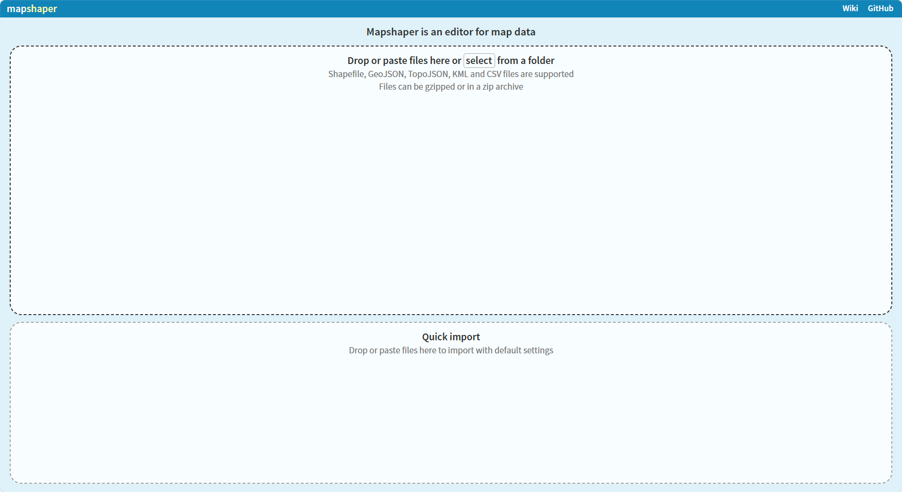

# 在线制作shp

实现流程 阿里云DataV.GeoAtlas + mapshaper

参考[三步教你免费下载省,市,区县行政区Shp数据](https://blog.csdn.net/laowe4535fdvdsa4t6qe/article/details/104204339)。

## DataV.GeoAtlas

[DataV.GeoAtlas](http://datav.aliyun.com/portal/school/atlas/area_selector)是阿里云提供的数据可视化平台。

界面如下图所示，

通过该平台，我们可以自由选取中国及指定省份的GeoJson/SVG文件。

在“范围选择器”界面，可以自由选取国家/省/市/县级别的单位，并下载相应位置的GeoJson/SVG文件；

在“边界生成器”界面，可以自由勾选指定区域，形成面状矢量文件，并下载相应位置的GeoJson/SVG文件；

## mapshaper

[mapshaper](https://mapshaper.org/)是一个可以显示多种矢量文件，并支持格式转换的在线工具。

界面如图所示，

通过该平台，我们可以导入GeoJson文件，并输出为Shapfile格式。
