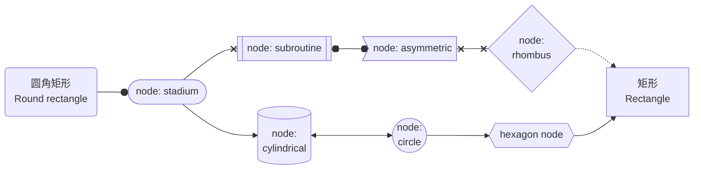
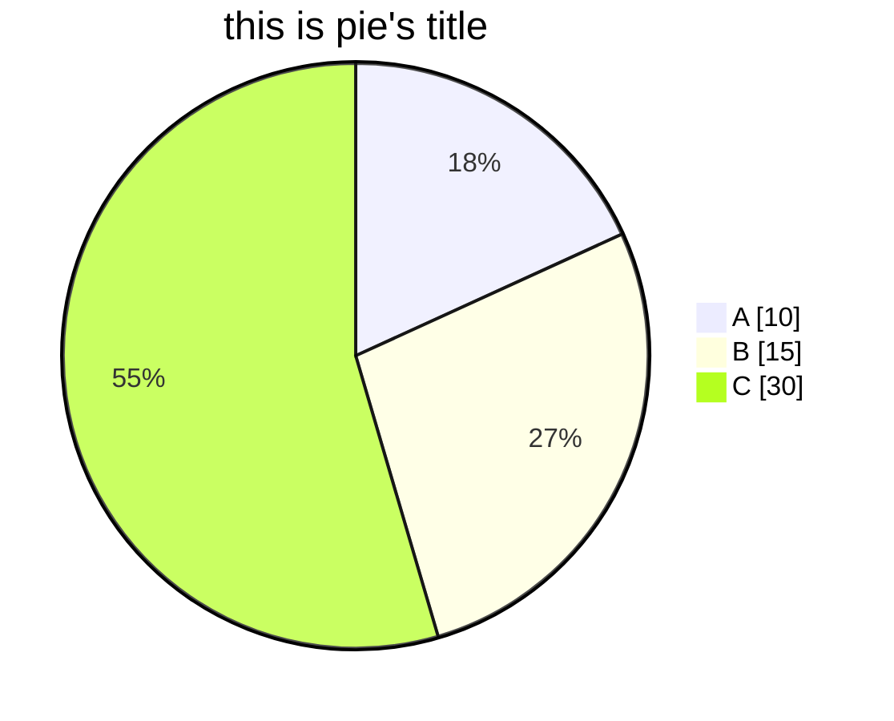

# MarkDown

markdown 相关语法

## 字体

斜体 & 粗体

`*italic*`: *italic*

`**bold**`: **bold**

`***italic&bold***`:***italic&bold***

删除线

`~~delete~~`: ~~delete~~

高亮

`==highlight==`: ==highlight==

转义符

对于一些有特殊含义的字符，如“\$”, “\_”, “\\”等字符，需要输入该字符时，在前方输入`\`即可。

## 段落格式

标题

```markdown
#       <!--一级标题-->
##      <!--二级标题-->
###     <!--三级标题-->
######     <!--最多可支持六级-->

<!--或者使用“---”“===”-->
```

分隔符

分隔符`---`：（如果“---”上一行紧邻文字，则是一级标题）

---

换行符

`&nbsp;`或者`<br/>`

更推荐使用`&nbsp;`（要带分号），因为`<br/>`是html格式。

## 列表

无序列表

` - `或 ` * `, 按tab键（一个占位符）切换为子列表，根据符号前占位长度判断无序列表层级

- list
- list2
  - sub-list
    - subsub-list
  - sub-list2

有序列表

输入`1.+spacebar`, 表示有序列表

1. first
2. second
3. third

## 引用

`>`代表引用, 引用中允许文本两行相邻输入, 显示为换行

> text
  next line test2

引用时，输入`>>`显示为引用中的引用, 以此类推, 但可能没什么应用场景

> 第一层
>> 第二层
> 这样跳不出去
>>> 还可以更深
>  
> 需要单独输出一行引用, 才可以跳出之前引用的层级

## 代码块

none

## 公式块

小的公式`$LaTeX$`：$LaTeX$

单独占行的公式:

```markdown
$$
y = \frac{a}{b}
$$
```

$$
y = \frac{a}{b}
$$

公式语法参考LaTeX, [KaTeX公式汇总](https://katex.org/docs/supported.html)(小部分公式/参数不适用)

## 表格

|商品|数量|单价|
|-|-------:|:------:|
|苹果|10|\$1|
|电脑|1|\$1000|

第一行代表表头各行名称, 以`|`作为间隔符

第二行描述停靠方向`:----:`或`---`代表居中, `----:`代表靠右, `:----`代表靠左, 其中`-`符号数量不做要求

## 画图 mermaid

markdown支持很多种图的绘制，包括流程图flowchart、饼图pie、甘特图gantt等

### flowchart

```markdown
flowchart LR
    s(圆角矩形\n Round rectangle)
    f[矩形\n Rectangle]
    n1([node: stadium])
    n2[[node: subroutine]]
    n3[(node:\n cylindrical)]
    n4((node:\n circle))
    n5>node: asymmetric]
    n6{node:\n rhombus}
    n7{{hexagon node}}

s --o n1
n1 --x n2
n1 --> n3
n3 <--> n4
n2 o--o n5
n5 x--x n6
n4 --> n7
n6 -.-> f
n7 --> f
```



### pie饼图

```markdown
pie showData
title this is pie's title
"A":10
"B":15
"C":30
```



[mermaid-js.github](https://mermaid-js.github.io/mermaid/#/), 有时无法登录, 需要链接外网

### TODO

- Sequence Diagram顺序图
- Class Diagram类图
- State Diagram状态图
- Entity Relationship Diagram实体关系图
- User Journey Diagram用户旅程图
- Gantt甘特图
- Requirement Diagram需求图
- Gitgraph Diagram Git分支图

## 希腊字母表

| 编号 | 大写        | 拼写     | 小写       |拼写      | 发音          |
| ---- | ---------- | -------- | ---------- | -------- | ------------- |
| 1    |  $\Alpha$  | \Alpha   | $\alpha$   | \alpha   | a:lf          |
| 2    |   $\Beta$  | \Beta    | $\beta$    | \beta    | bet           |
| 3    | $\Gamma$   | \Gamma   | $\gamma$   | \gamma   | ga:m          |
| 4    | $\Delta$   | \Delta   | $\delta$   | \delta   | delt          |
| 5    | $\Epsilon$ | \Epsilon | $\epsilon$ | \epsilon | ep\`silon     |
| 6    |  $\Zeta$   | \Zeta    | $\zeta$    | \zeta    | zat           |
| 7    |  $\Eta$    | \Eta     | $\eta$     | \eta     | eit           |
| 8    | $\Theta$   | \Theta   | $\theta$   | \theta   | θit           |
| 9    |  $\Iota$   | \Iota    | $\iota$    | \iota    | aiot          |
| 10   |  $\Kappa$  | \Kappa   | $\kappa$   | \kappa   | kap           |
| 11   | $\Lambda$  | \Lambda  | $\lambda$  | \lambda  | lambd         |
| 12   |   $\Mu$    | \Mu      | $\mu$      | \mu      | mju           |
| 13   |   $\Nu$    | \Nu      | $\nu$      | \nu      | nju           |
| 14   | $\Xi$      | \Xi      | $\xi$      | \xi      | ksi           |
| 15   | $\Omicron$ | \Omicron | $\omicron$ | \omicron | omik\`ron     |
| 16   | $\Pi$      | \Pi      | $\pi$      | \pi      | pai           |
| 17   |  $\Rho$    | \Rho     | $\rho$     | \rho     | rou           |
| 18   | $\Sigma$   | \Sigma   | $\sigma$   | \sigma   | \`sigma       |
| 19   |  $\Tau$    | \Tau     | $\tau$     | \tau     | tau           |
| 20   | $\Upsilon$ | \Upsilon | $\upsilon$ | \upsilon | jup\`silon    |
| 21   | $\Phi$     | \Phi     | $\phi$     | \phi     | fai           |
| 22   |  $\Chi$    | \Chi     | $\chi$     | \chi     | phai          |
| 23   | $\Psi$     | \Psi     | $\psi$     | \psi     | psai          |
| 24   | $\Omega$   | \Omega   | $\omega$   | \omega   | o\`miga       |