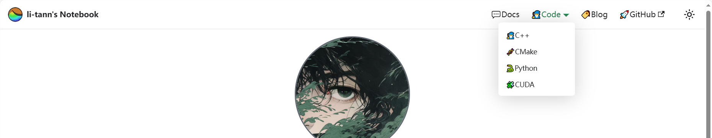
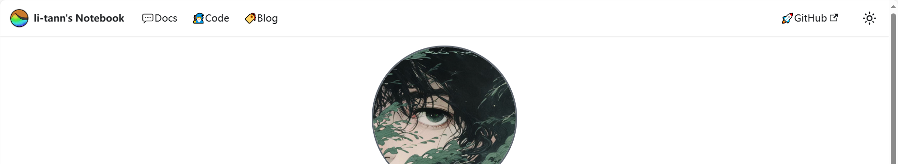

# Docusaurus

[docusaurus](https://docusaurus.io/zh-CN/)官网的介绍其实还挺详细的，但有的网络登录不上便简单写个blog，以备不时之需~

[docusaurus中文网](https://www.docusaurus.cn/)翻译一半反而感觉怪怪的，更何况官网还有中文版。

## 本地部署

下载Node.js，

Node.js查看镜像源和换源,

`npm config get registry`, 查看镜像源，默认是"https://registry.npmjs.org"

`npm config set registry https://registry.npm.taobao.org`, 修改淘宝的镜像源。

下载默认的docusaurus模板,

`npx create-docusaurus@latest my-website classic`,

切换到my-website地址下, 命令行输入`npm start`启动默认模板，

完成本地部署。

## 自定义修改

### 文件结构

- src/pages，目录存放独立页面，index.md、index.html、index.js...等等默认是主页，当然也可以在docusaurus.config.js中修改。

- static，用于存放静态文件，在项目构建后会被加载到各个页面中（大概）例如static/img用于存放各种图片。

- docs，用于存放主要文章

- blog，短篇的博客文，使用yyyy-mm-dd-title.md的命名方式，网页构建时会自动加载时间、作者信息等内容

### docusaurus.config.js介绍

docusaurus.config.js 内部结构说明...

```js
/** @type {import('@docusaurus/types').Config} */
const config = {
  title: 'lt\'s notebook',
  tagline: 'li-tann\'s notebook',
  favicon: 'img/SAR-LOGO2.png',

  // Set the production url of your site here
  url: 'https://li-tann.github.io',
  // Set the /<baseUrl>/ pathname under which your site is served
  // For GitHub pages deployment, it is often '/<projectName>/'
  baseUrl: '/',

  // GitHub pages deployment config.
  // If you aren't using GitHub pages, you don't need these.
  organizationName: 'li-tann', // Usually your GitHub org/user name.
  projectName: 'li-tann.github.io', // Usually your repo name.
  deploymentBranch: 'gh-pages',
  trailingSlash: false,
  ...
}
```

`title` `tagline` `favicon`三个字段用于修改网页的标签页；

`organizationName` `projectName` `deploymentBranch`三个字段部署到github时使用；

```js
...
themeConfig:
    /** @type {import('@docusaurus/preset-classic').ThemeConfig} */
    ({
      // Replace with your project's social card
      image: 'img/docusaurus-social-card.jpg',
      navbar: {
        ...
      },
      footer: {
        ...
      }
      ...
    })
...    
```

`navbar`用于修改网页顶部栏内容，

`footwe`用于修改网页底部栏内容

有遗漏信息后续再补充...

### 添加插件

docusaurus插件有很多，但我的需求是显示数学公式的插件，`math`和`katex`。

参考[Docusaurus-Markdown特性-数学公式](https://docusaurus.io/zh-CN/docs/markdown-features/math-equations)

首先需要先安装插件`remark-math`和`rehype-katex`，由于最新版插件与Docusaurus 2不兼容，所以一定要安装制定版本

`npm install --save remark-math@3 rehype-katex@5 hast-util-is-element@1.1.0`

然后，在docusaurus.config.js中添加几行代码，

在顶部添加

```js
const math = require('remark-math');
const katex = require('rehype-katex');
```

在`docs:{...}`中添加

```js
docs:{
...
remarkPlugins: [math],
rehypePlugins: [katex],
}
```

最后，在presets:[...],后面添加

```js
presets:[
...
],
stylesheets: [
    {
      href: 'https://cdn.jsdelivr.net/npm/katex@0.13.24/dist/katex.min.css',
      type: 'text/css',
      integrity:
        'sha384-odtC+0UGzzFL/6PNoE8rX/SPcQDXBJ+uRepguP4QkPCm2LBxH3FA3y+fKSiJ+AmM',
      crossorigin: 'anonymous',
    },
  ],
```

## github部署

github.io可以为每个用户提供一个个人博客，（粗略的理解）

在docusaurus.config.js中进行配置、在github中创建仓库、使用`deploy`命令完成个人博客的部署。

docusaurus提供deploy命令，可以一键部署到github中，需要提供GIT_USER

`cmd /C "set "GIT_USER=<GITHUB_USERNAME>" && yarn deploy"`

例如: `cmd /C 'set "GIT_USER=li-tann" && yarn deploy'`

:::caution

从 2021 年 8 月开始，GitHub 要求每次命令行登录都使用个人访问令牌，而不是密码。 当 GitHub 提示你输入密码时，请输入个人访问令牌。 更多信息请见 GitHub 文档。

或者，你也可以使用 SSH (USE_SSH=true) 登录。

:::

在实际操作中可能会失败很多次，不确定其原因，但一直提交总会有成功的时候...

有时，搭配`cmd /C 'set "USE_SSH=true" && yarn deploy'`有奇效...

## 多文档实现

在docusaurus默认的结构中, 所有文档都存在docs文件中。但文件内容过多时，会使docs看起来很臃肿，这时就需要多个文档来分开存储内容。

### 单层文档

首先，在文档中，创建文件夹（这里命名为code），并在文件夹内创建“欢迎页”“intro.md”。

```shell
 - project
   - ...
   - blog
   - code
     - intro.md
   - docs
   - ...
```

在docusaurus.config.js文件中添加插件

```js
themes: [...],
plugins:[
  [
    "@docusaurus/plugin-content-docs",
    {
      id: "code",
      path: "code",
      routeBasePath: "code",
      sidebarPath: require.resolve("./sidebars.js"),
    },
  ],
],
  presets: [.....],
```

创建完成后，使用`npm start`启动工程（主要是为了编译一次）。

```js
themeConfig:
    /** @type {import('@docusaurus/preset-classic').ThemeConfig} */
    ({
      // Replace with your project's social card
      image: 'img/docusaurus-social-card.jpg',
      navbar: {
        //...
        items: [
          {
            type: 'doc', 
            docId: 'intro',
            position: 'right',
            label: 'Docs',
          },
          {to: '/blog', label: 'Blog', position: 'right'},
          {///// here
            position:"right",
            label:"Code",
            to:"/code/intro"
          },/////
          {
            href: 'https://github.com/li-tann/li-tann.github.io',
            label: 'GitHub',
            position: 'right',
          },
        ],
      },
```

在themeConfig-navbar-items中添加`{label:"what your want",to:"code/intro"}`, 再次更新后即可成功添加到页面导航栏中。

点击“按钮”可以连接到`code/intro`中。

### 多层文档

多层文档实现的效果是，当鼠标悬停到这里时，会出现一个“下拉”菜单，点击菜单中任意一个按钮会转到相应的链接。

示例代码对应的文件结构是：

```shell
 - project
   - ...
   - blog
   - code
     - cmake
       - intro.md
     - cpp
       - intro.md
     - python
       - intro.md
     - cuda
       - intro.md
   - docs
   - ...
```

在plugins中添加相应的id，

```js
themes: [...],
plugins:[
  [
    "@docusaurus/plugin-content-docs",
    {
      id: "cmake",
      path: "code/cmake",
      routeBasePath: "cmake",
      sidebarPath: require.resolve("./sidebars.js"),
    },
  ],
  [
    "@docusaurus/plugin-content-docs",
    {
      id: "cpp",
      path: "code/cpp",
      routeBasePath: "cpp",
      sidebarPath: require.resolve("./sidebars.js"),
    },
  ],
  [
    "@docusaurus/plugin-content-docs",
    {
      id: "python",
      path: "code/python",
      routeBasePath: "python",
      sidebarPath: require.resolve("./sidebars.js"),
    },
  ],
  [
    "@docusaurus/plugin-content-docs",
    {
      id: "cuda",
      path: "code/cuda",
      routeBasePath: "cuda",
      sidebarPath: require.resolve("./sidebars.js"),
    },
  ],
],
  presets: [.....],
```

启动工程后,

```js
themeConfig:
    /** @type {import('@docusaurus/preset-classic').ThemeConfig} */
    ({
      // Replace with your project's social card
      image: 'img/docusaurus-social-card.jpg',
      navbar: {
        //...
        items: [
          {
            type: 'doc', 
            docId: 'intro',
            position: 'right',
            label: 'Docs',
          },
          {to: '/blog', label: 'Blog', position: 'right'},
          { /// here
            position:"right",
            label:"Code",
            items:[
              {
                label: "C++",
                to:"cpp/intro"
              },
              {
                label: "CMake",
                to:"cmake/intro"
              },
              {
                label: "Python",
                to:"python/intro"
              },
              {
                label: "CUDA",
                to:"cuda/intro"
              },
            ]
          }, ///here
          {
            href: 'https://github.com/li-tann/li-tann.github.io',
            label: 'GitHub',
            position: 'right',
          },
        ],
      },
```

即可。

效果如图所示：



使用这种方法可以自由灵活的在标题栏增加相应的内容, 唯一的确定是不能正常显示katex公式。

## 多文档实现2

上述方法虽然可以实现标题栏有多个文档，但缺点是除docs以外的文档无法享用docs的katex服务，即不能正常显示公式。

[官方文档](https://docusaurus.io/docs/create-doc#sidebars)如是说：

> When using autogenerated sidebars, the file structure will determine the sidebar structure.
> Our recommendation for file system organization is: make your file system mirror the sidebar structure (so you don't need to handwrite your sidebars.js file), and use the slug front matter to customize URLs of each document.

一开始配置环境时只图省事，将sidebar.js设置为自动生成模式，虽然便利但同时也失去了自定义的能力。

```js
// sidebar.js

const sidebars = {
  // By default, Docusaurus generates a sidebar from the docs folder structure
  tutorialSidebar: [{type: 'autogenerated', dirName: '.'}],
};

module.exports = sidebars;
```

所以解决方法也已明了，自定义sidebar.js。

参考学习：[docusaurus sidebar](https://docusaurus.io/docs/sidebar)

我们需要将文件拆分为多个数组(也许是这么称呼?), 并在docusaurus.config.js中添加标题栏及其链接方式，创建多个支持渲染katex公式的文档。

修改sidebar.js文件,

```js
// sidebar.js

const sidebars = {
  // By default, Docusaurus generates a sidebar from the docs folder structure
    docs:[
    'intro',
    'docusaurus',
    {
      type: 'autogenerated',
      dirName: 'document'
    },
    'color_table',
    'software',
  ],
  code:[
    {
      type: 'autogenerated',
      dirName: 'code'
    },
  ]
};

module.exports = sidebars;
```

修改dacusaurus.config.js文件,

```js
//dacusaurus.config.js

// ....
  presets: [
    [
      'classic',
      /** @type {import('@docusaurus/preset-classic').Options} */
      ({
        docs: {
          path: 'docs', /// 使用"sidebars.docs"的侧边栏
          sidebarPath: require.resolve('./sidebars.js'),
          // ...
        },
        //...
      })
      //...
    ]]
// ...

themeConfig:
  /** @type {import('@docusaurus/preset-classic').ThemeConfig} */
  ({
    // ...
    navbar: {
      //...
      items: [
        {
          type: 'doc',
          docId: 'intro',
          position: 'left',
          label: '💬Docs',
        },
        {
          type: 'docSidebar',
          position: 'left',
          sidebarId: 'code',/// 使用"sidebars.code"的侧边栏
          label: '🧙Code',
        },
        // ...
      ],
      //...
    },
  })  

```

效果如图所示：



优点是code内的内容仍属于docs, 享有docs的katex组件功能。
