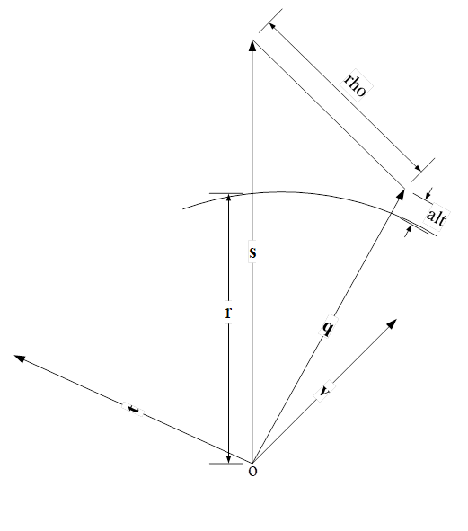

## geo_loc

通过指定的斜距 $rho$和轨道位置矢量 $s$, $v$计算出其对应的大地坐标 $lat$, $lon$

### 几何关系

代码涉及点和向量信息如下图所示，



### 以无误差值推算公式

代码中的`a`和`b`和`det`可以进一步推导得到：

$$
\begin{aligned}
a ={}& \frac{s^2+q^2-rho^2}{2}\\
  ={}&\lvert s \rvert \lvert q \rvert cos(\angle soq) \\\\
b ={}&\frac{\lambda \cdot rho \cdot fd + 2 \cdot sv}{2}\\
  ={}& q \cdot v \\\\
det = {}&s^2v^2-(sv)^2 \\
    = {}&\lvert s\rvert^2\lvert v\rvert^2-\lvert s\rvert^2\lvert v\rvert^2cos^2(\angle sov) \\
    = {}&\lvert s\rvert^2\lvert v\rvert^2sin^2(\angle sov) \\
    = {}&\lvert t\rvert^2 \\\\
\end{aligned}
$$

这里将 $r+alt$等效为 $\lvert q \rvert$ ，但实际上两者存在一定误差，下一节在讨论该问题。

分别带入 $c_1$和 $c_2$，得到：

$$
\begin{aligned}
c_1=&\frac{a\cdot v^2-b\cdot sv}{det}\\
  =&\frac{\lvert s\rvert\lvert q\rvert cos(\angle soq)\lvert v\rvert^2-\lvert q\rvert\lvert v\rvert cos(\angle qov)\lvert s\rvert\lvert v\rvert cos(\angle sov)}{\lvert s\rvert^2\lvert v\rvert^2 sin^2(\angle sov)} \\
  =&\frac{\lvert q\rvert cos(\angle soq)-\lvert q\rvert cos(\angle qov) cos(\angle sov)}{\lvert s\rvert sin^2(\angle sov)} \\
c_2=&\frac{b\cdot s^2-a\cdot sv}{det}\\
   =&\frac{\lvert q\rvert\lvert v\rvert cos(\angle qov)\lvert s\rvert^2-\lvert s\rvert\lvert q\rvert cos(\angle soq)\lvert s\rvert\lvert v\rvert cos(\angle sov)}{\lvert s\rvert^2\lvert v\rvert^2 sin^2(\angle sov)} \\
   =&\frac{\lvert q\rvert cos(\angle qov)-\lvert q\rvert cos(\angle soq) cos(\angle sov)}{\lvert v\rvert sin^2(\angle sov)} \\
\end{aligned}
$$

如果近似的认为 $\angle sov \approx 90 \degree$，则有，

$$
\begin{aligned}
  cos(\angle sov) \approx 0   \\
  sin(\angle sov) \approx 1 
\end{aligned}
$$

从而得到 $c_1$和 $c_2$的近似值：

$$
\begin{aligned}
c_1 = & \frac{\lvert q\rvert cos(\angle soq)}{\lvert s\rvert} \\
c_2 = & \frac{\lvert q\rvert cos(\angle qov)}{\lvert v\rvert} \\
\end{aligned}
$$

同理，得到 $c_3$:

$$
\begin{aligned}
c_3 =& \pm\sqrt{\frac{q^2-c_1^2s^2-c_2^2v^2-2c_1\cdot c_2\cdot sv}{t^2}} \\
    =& \pm \frac{\sqrt{q^2 - \lvert q \rvert^2 cos^2(\angle soq)-\lvert q \rvert^2 cos^2(\angle qov)}}{\lvert t \rvert} \\
    =& \pm \frac{\lvert q\rvert cos(\angle qot)}{\lvert t\rvert} \\
\end{aligned}
$$

可知， $c_1$、 $c_2$、 $c_3$分别为向量q的单位向量在 $s$、 $v$、 $t$坐标轴上的分量，所以有：

$$
q = c_1 \cdot s + c_2 \cdot v + c_3 \cdot t
$$

### 考虑误差

上一节中默认将 $r+alt$等效为 $\lvert q\rvert$，但实际上两者存在一定误差。

为了简化公式，现记误差值 $r+alt$为 $\hat{q}$，可以得到：

$$
\begin{aligned}
c_1 = &\frac{\lvert \hat{q}\rvert cos(\angle \hat{q}os)}{\lvert s \rvert} \\
c_2 = &\frac{\lvert q\rvert cos(\angle qov)}{\lvert v \rvert} \\
c_3 =& \pm \frac{\sqrt{\hat{q}^2 - \lvert \hat{q} \rvert^2 cos^2(\angle \hat{q}os)-\lvert q \rvert^2 cos^2(\angle qov)}}{\lvert t \rvert} \\
    \approx& \pm \frac{\lvert \hat{q}\rvert cos(\angle \hat{q}ot)}{\lvert t\rvert} \\ 
\end{aligned}
$$

所以，

$$
q \ne c_1 \cdot s + c_2 \cdot v + c_3 \cdot t
$$

通过上式得到的向量 $\hat q_{k+1}$的模长介于 $\lvert \hat q_k\rvert$和 $\lvert q\rvert$之间，满足迭代收敛条件。

### 代码学习

```C
/// @brief: subroutine to calculate the lat/lon/altitude of the intersection of the radar look vector with the geoid for a specfied average terrain height.
/// @param ra: ellipsoid semi-major axis
/// @param e2: ellipsoid square of eccentricity
/// @param rho: slant range (m)
/// @param fd: Doppler frequency (Hz)
/// @param fc: radar carrier frequency (Hz)
/// @param alt: nominal terrain altitude (m)
/// @param s_flag: flag to determine if right or left looking (left looking=1, right looking= -1)
/// @param s: position vector of the radar, (earth fixed coordinates)(m)
/// @param v: velocity vector of the radar (earth fixed coordinates)(m/s)
/// @param lat: output latitude (decimal degrees)
/// @param lon: output longitude(decimal degrees)
void geo_loc(double ra, double e2, double rho, double fd, double fc, double alt, int s_flag, VEC *s, VEC *v, double *lat, double *lon) {

  double a, b, c, r, r1, lam;
  double s2, v2, t2, sv, det;
  double lat1, lon1, alt1, c1, c2, c3;
  double r_new;
  VEC q, t;
  int iter;

  lam = C / fc;
  s2 = dot(s, s);
  v2 = dot(v, v);
  sv = dot(v, s);
  xyz_ll(ra, e2, s, &lat1, &lon1, &alt1);
  r = sqrt(s2) - alt1;
  cross(s, v, &t);
  t2 = dot(&t, &t);

  iter = 0;
  while (iter < 8 ) {
    iter++;
    a = (s2 + SQR(r + alt) - SQR(rho)) / 2.0;
    b = (lam * rho * fd + 2.0 * sv) / 2.0;
    c = SQR(r + alt);

    det = s2 * v2 - SQR(sv);

    c1 = (a * v2 - b * sv) / det;
    c2 = (b * s2 - a * sv) / det;
    c3 = (double)s_flag * sqrt((c - SQR(c1) * s2 - SQR(c2) * v2 - 2.0 * c1 * c2 * sv) / t2);

    /*  radius vector to image point is q = c1*s + c2*v + c3*t */

    q.x = c1 * s->x + c2 * v->x + c3 * t.x;
    q.y = c1 * s->y + c2 * v->y + c3 * t.y;
    q.z = c1 * s->z + c2 * v->z + c3 * t.z;

    xyz_ll(ra, e2, &q, &lat1, &lon1, &alt1);

    r1 = norm(&q);  /* includes surface altitude of alt1, earth radius=r1-alt1 */
    r_new = r1 - alt1;
    if (fabs(r_new - r) < .001)break;
    r = r_new;
  }

  *lat = lat1;  /* return solution */
  *lon = lon1;
}
```
