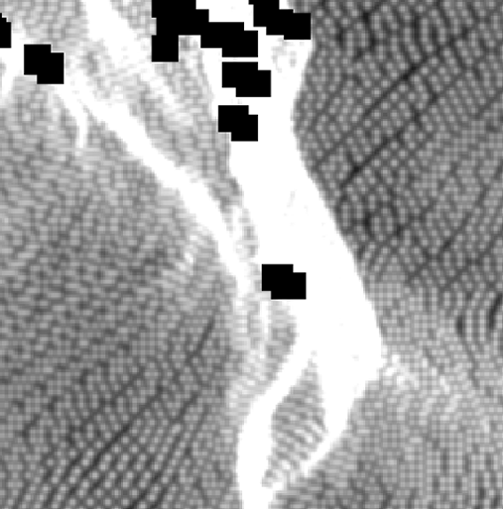
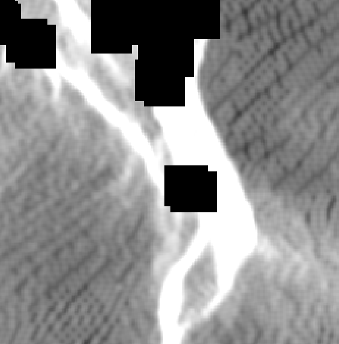

# RG滤波

RollingGuidence滤波

## image

|||
|:---:|:---:|
|pic.1 before filter|pic.2 after filter|

## 算法流程

### Step1: Small Structure Removal

$$
J_1(p)=\frac{1}{K_p}\displaystyle\sum_{q\in N(p)}\exp \bigg(-\frac{ {\|p-q\|}^2} {2\sigma_s^2}\bigg)I(q) 
$$

$$
K_p=\displaystyle\sum_{q\in N(p)}{\exp \big(-\frac{ {\|p-q\|}^2} {2\sigma_s^2}\big)}
$$

其中， $p$是待求点， $q$是 $p$周围的所有点的集合， $I$是原图像， $\sigma_s^2$是标准偏差（ standard deviation）自己设定。通过这一步可以消除尺度小于 $\sigma_s^2$的结构。

（This filter completely removes structures whose scale is smaller than $\sigma_s^2$ as claimed in the scale space theory. It is implemented efficiently by separating kernels in perpendicular directions. Approximation by box filter is also feasible.）

### Step2: Edge Recovery

$$
J_{t+1}(p)=\frac{1}{K_p}\displaystyle\sum_{q\in N(p)}\exp \bigg(-\frac{ {\|p-q\|}^2}{2\sigma_s^2}-\frac{ {\|J_t(p)-J_t(q)\|}^2}{2\sigma_r^2}\bigg)I(q)
$$

$$
K_p=\displaystyle\sum_{q\in N(p)}\exp \bigg(-\frac{ {\|p-q\|}^2}{2\sigma_s^2}-\frac{ {\|J_t(p)-J_t(q)\|}^2}{2\sigma_r^2}\bigg)
$$

其中，$p$是待求点，$q$是 $p$周围的所有点的集合， $t=1,2,…,n$， $I$是原图像， $\sigma_s^2$和 $\sigma_r^2$分别控制时间权重和距离权重。( $\sigma_s^2$ and $\sigma_r^2$ control the spatial and range weights respectively )

## C++代码

详见[RG Filter代码](#C++代码)

暂未上传。
