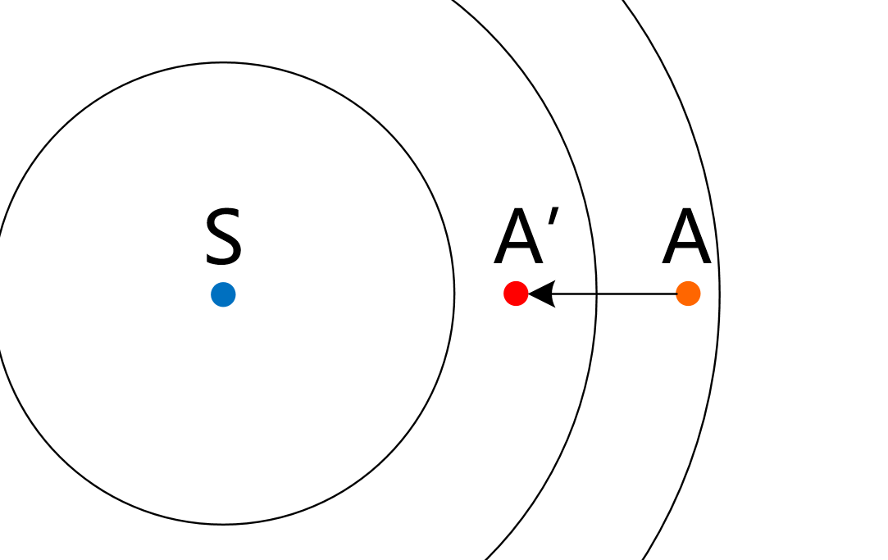
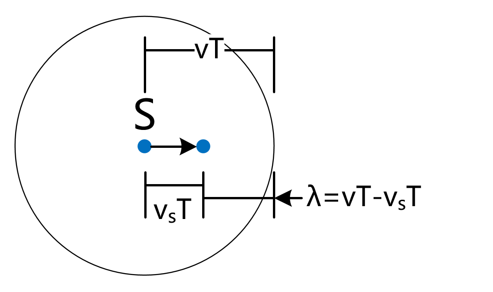
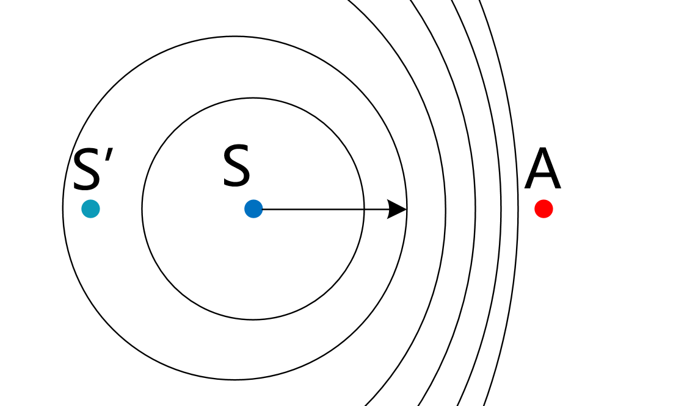
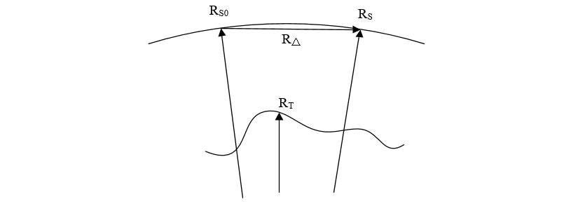

# 距离-多普勒模型

R-D模型公式推导

## 公式总览

$$
\begin{align}
    {Rj}^2 =& (\vec{R_S}-\vec{R_T})^2   \\
    f_d    =& \frac{2}{\lambda}\frac{(\vec{R_S}-\vec{R_T})V_S}{\lvert\vec{R_S}-\vec{R_T} \rvert}
\end{align}
$$

式中， $R_j$为卫星, $S$到地物点, $T$的斜距, $R_S$是卫星的位置矢量, $R_T$是地物点的位置矢量。

## 公式推导

### 距离方程

### 多普勒方程

对于SAR，整个过程分为两个阶段

1. 卫星发出信号，地物接收
    >视SAR为声源，地物为观察者。
    >声源向着观察者方向移动，观察者不动。
2. 地物反射信号，卫星接收
    >视地物为声源，SAR为观察者。
    >声源不动，观察者移动。

设SAR发射的电磁波频率为 $f_0$，1.中地物接收的频率为 $f'$，2.中卫星接收的频率为 $f$，则有

$$
\begin{align}
    f'=& \frac{c}{c-w'}f_0 \\
    f =& \frac{c+w'}{c}f'
\end{align}
$$

其中， $c$为光速， $w'=w\cos\psi$， $w$为卫星速度矢量， $\psi$为方位角。

公式原理参考[多普勒效应](#多普勒效应)。

所以，多普勒频移

$$
\begin{aligned}
    \Delta f =& f - f_0 \\
             =& (\frac{c+w'}{c-w'}-1)f_0 \\
             =& \frac{2w'}{c-w'}f_0 \\
       \approx&  \frac{2w'}{\lambda} = \frac{2}{\lambda}\cdot \frac{dR}{dt}
\end{aligned}
$$

其中， $w'$为 $w$在 $\overrightarrow{TS}$方向的分量， $R=(X_S-X_T,Y_S-Y_T,Z_S-Z_T)\cdot(\pm1)$

$$
\begin{aligned}
    w'= \frac{dR}{dt}
    =& \pm d\sqrt{(X_S-X_T)^2+(Y_S-Y_T)^2+(Z_S-Z_T)^2}/dt \\
    =& \pm \frac{(X_S-X_T)(V_{SX}-V_{TX})+(Y_S-Y_T)(V_{SY}-V_{TY})+(Z_S-Z_T)(V_{SZ}-V_{TZ})}{\sqrt{(X_S-X_T)^2+(Y_S-Y_T)^2+(Z_S-Z_T)^2}} \\
    \because V_t =& 0 \\
    \therefore w'
    =& \frac{dR}{dt}
    = \pm \frac{(\vec{R_S}-\vec{R_T})\vec{V_S}}{\lvert \vec{R_S}-\vec{R_T} \rvert}
\end{aligned}
$$

综上所述,

$$
\begin{align}
    \Delta f = \frac{2}{\lambda}\frac{(\vec{R_S}-\vec{R_T})\vec{V_S}}{\lvert \vec{R_S}-\vec{R_T} \rvert}
\end{align}
$$

## 多普勒效应

多普勒效应是RD模型中，多普勒方程的基础。

观察者 $A$，声源 $S$. 观察者移动速度为 $v_A$，声源移动速度为 $v_S$，波的速度和频率分别为 $v$和 $f$。

### 1.观察者移动，声源不动



当 $A$移动到 $A'$时，走过距离 $v_At$，声传播距离 $vt$.

所以， $A$经历的波数 $N$等于 $(v_A+v)t$除以波长 $\lambda$，即

$$
N=\dfrac{v_At+vt}{\lambda}
$$

波数 $N$除以时间 $t$，即为单位时间的波数，等效为频率

$$
\begin{aligned}
f'=& \frac{v_At+vt}{\lambda t}\\
=& \frac{v_A+v}{\lambda } \\
=& \frac{v+v_A}{v}f > f
\end{aligned}
$$

由上可知，当观察者 $A$向波源 $S$移动时，接收到的频率 $f'$**大于**波源发出的频率 $f$。反之，逃离时则**小于**。

### 2.声源移动，观察者不动



已知 $f=\dfrac{1}{T}$， $T$为发射一个波所需要的时间， $T$时间内，博得传播速度为 $vT$，波源的移动距离为 $v_ST$. 此时，波源 $S$到波的距离即为波长,

$$
\lambda = vT-v_ST
$$

认为当波源 $S$向观察者 $A$移动时，波长 $\lambda$缩短。



以观察者接受到声波为起始时间，共精力时间 $t$，此时波的传播距离为 $vt$，除以波长得到波数（ $A$接收到波的个数）

$$
N'=\frac{vt}{\lambda}=\frac{vt}{vT-v_ST}=\frac{vt}{v-v_S}f
$$

波数 $N'$除以时间 $t$，即为单位时间接收到的声波个数，等效为频率

$$
f'=\frac{\frac{vt}{v-v_S}f}{t}=\frac{v}{v-v_S}f > f
$$

所以，当声源向观察者移动时（ $v_S>0$），接收到的频率 $f'$**大于**波源的发出频率 $f$，反之则**小于**。

## 基于RD模型的坐标转换

### i,j,h->lat,lon

通过指定的斜距 $rho$和轨道位置矢量 $s$, $v$计算出其对应的大地坐标 $lat$, $lon$

代码涉及点和向量信息如下图所示，


#### 代码实现

```c++
/// class llh{
///   double longitude, latitude, height; 
///   xyz to_xyz(); // 转换到空间直角坐标系
///   //...
/// };
/// class xyz{
///   double x, y, z; 
///   double norm(); // 取模
///   xyz cross(xyz sec); //外积, 叉乘
///   xyz operator-(xyz sec); //向量相减
///   xyz operator+(xyz sec); //向量相加
///   double operator*(xyz sec);  //内积, 点乘
///   xyz operator*(double m);  // 向量乘常数
///   llh to_llh(); // 转换到经纬度
///   //...
/// };

llh parameter_sar::get_target_loc(double az_row, double sr_col, double alt)
{
    double C = 299792458; //光速
    double rho = this->get_slant_range(sr_col);   //计算斜距
    
    double fc = radar_frequency;
    int s_flag = (look_direction == Look_Diredction::right)?-1:1; //左右视
    double state_t = this->get_azimuth_time(az_row); //根据简单比例关系估计方位向时间 state_t = az_start + azTimeSpacing * az_row
    double fd = 0;
    if (!azimuth_deskew) {
        fd = get_fd(state_t, rho); // 计算多普勒频移
    }
    xyz s = this->get_state_pos(state_t );
    xyz v = this->get_state_velo(state_t );

    llh dst;
    double a, b, c, r, r1, lam;
    double s2, v2, t2, sv, det;
    double lat1, lon1, alt1, c1, c2, c3;
    double r_new;
    xyz q, t;
    int iter;

    lam = C / fc;
    s2 = s * s;
    v2 = v * v;
    sv = v * s;
    llh temp = s.to_llh();
    lon1 = temp.longitude;
    lat1 = temp.latitude;
    alt1 = temp.height;

    r = sqrt(s2) - alt1;
    t = s.cross(v);
    t2 = t * t;

    iter = 0;
    while (iter < 17 )
    {
      iter++;

      a = (s2 + SQR(r + alt) - SQR(rho)) / 2.0;
      b = (lam * rho * fd + 2.0 * sv) / 2.0;
      c = SQR(r + alt);

      det = s2 * v2 - SQR(sv);

      c1 = (a * v2 - b * sv) / det;
      c2 = (b * s2 - a * sv) / det;
      c3 = double(s_flag) * sqrt((c - pow(c1,2) * s2 - pow(c2,2) * v2 - 2.0 * c1 * c2 * sv)/t2);

      /*  radius vector to image point is q = c1*s + c2*v + c3*t */
      q = s * c1 + v *c2 + t * c3;

      llh temp2 = q.to_llh();
      lon1 = temp2.longitude;
      lat1 = temp2.latitude;
      alt1 = temp2.height;

      r1 = q.norm();        /* includes surface altitude of alt1, earth radius=r1-alt1 */
      r_new = r1 - alt1;
      if (fabs(r_new - r) < .001)
          break;
      r = r_new;
    }

    dst.latitude = lat1;
    dst.longitude = lon1;
    dst.height = alt;

    return dst;
}
```

#### 以无误差值推算公式

代码中的`a`和`b`和`det`可以进一步推导得到：

$$
\begin{aligned}
a ={}& \frac{s^2+q^2-rho^2}{2}\\
  ={}&\lvert s \rvert \lvert q \rvert cos(\angle soq) \\\\
b ={}&\frac{\lambda \cdot rho \cdot fd + 2 \cdot sv}{2}\\
  ={}& q \cdot v \\\\
det = {}&s^2v^2-(sv)^2 \\
    = {}&\lvert s\rvert^2\lvert v\rvert^2-\lvert s\rvert^2\lvert v\rvert^2cos^2(\angle sov) \\
    = {}&\lvert s\rvert^2\lvert v\rvert^2sin^2(\angle sov) \\
    = {}&\lvert t\rvert^2 \\\\
\end{aligned}
$$

这里将 $r+alt$等效为 $\lvert q \rvert$ ，但实际上两者存在一定误差，下一节在讨论该问题。

分别带入 $c_1$和 $c_2$，得到：

$$
\begin{aligned}
c_1=&\frac{a\cdot v^2-b\cdot sv}{det}\\
  =&\frac{\lvert s\rvert\lvert q\rvert cos(\angle soq)\lvert v\rvert^2-\lvert q\rvert\lvert v\rvert cos(\angle qov)\lvert s\rvert\lvert v\rvert cos(\angle sov)}{\lvert s\rvert^2\lvert v\rvert^2 sin^2(\angle sov)} \\
  =&\frac{\lvert q\rvert cos(\angle soq)-\lvert q\rvert cos(\angle qov) cos(\angle sov)}{\lvert s\rvert sin^2(\angle sov)} \\
c_2=&\frac{b\cdot s^2-a\cdot sv}{det}\\
   =&\frac{\lvert q\rvert\lvert v\rvert cos(\angle qov)\lvert s\rvert^2-\lvert s\rvert\lvert q\rvert cos(\angle soq)\lvert s\rvert\lvert v\rvert cos(\angle sov)}{\lvert s\rvert^2\lvert v\rvert^2 sin^2(\angle sov)} \\
   =&\frac{\lvert q\rvert cos(\angle qov)-\lvert q\rvert cos(\angle soq) cos(\angle sov)}{\lvert v\rvert sin^2(\angle sov)} \\
\end{aligned}
$$

如果近似的认为 $\angle sov \approx 90 \degree$，则有，

$$
\begin{aligned}
  cos(\angle sov) \approx 0   \\
  sin(\angle sov) \approx 1 
\end{aligned}
$$

从而得到 $c_1$和 $c_2$的近似值：

$$
\begin{aligned}
c_1 = & \frac{\lvert q\rvert cos(\angle soq)}{\lvert s\rvert} \\
c_2 = & \frac{\lvert q\rvert cos(\angle qov)}{\lvert v\rvert} \\
\end{aligned}
$$

同理，得到 $c_3$:

$$
\begin{aligned}
c_3 =& \pm\sqrt{\frac{q^2-c_1^2s^2-c_2^2v^2-2c_1\cdot c_2\cdot sv}{t^2}} \\
    =& \pm \frac{\sqrt{q^2 - \lvert q \rvert^2 cos^2(\angle soq)-\lvert q \rvert^2 cos^2(\angle qov)}}{\lvert t \rvert} \\
    =& \pm \frac{\lvert q\rvert cos(\angle qot)}{\lvert t\rvert} \\
\end{aligned}
$$

可知， $c_1$、 $c_2$、 $c_3$分别为向量q的单位向量在 $s$、 $v$、 $t$坐标轴上的分量，所以有：

$$
q = c_1 \cdot s + c_2 \cdot v + c_3 \cdot t
$$

#### 考虑误差

上一节中默认将 $r+alt$等效为 $\lvert q\rvert$，但实际上两者存在一定误差。

为了简化公式，现记误差值 $r+alt$为 $\hat{q}$，可以得到：

$$
\begin{aligned}
c_1 = &\frac{\lvert \hat{q}\rvert cos(\angle \hat{q}os)}{\lvert s \rvert} \\
c_2 = &\frac{\lvert q\rvert cos(\angle qov)}{\lvert v \rvert} \\
c_3 =& \pm \frac{\sqrt{\hat{q}^2 - \lvert \hat{q} \rvert^2 cos^2(\angle \hat{q}os)-\lvert q \rvert^2 cos^2(\angle qov)}}{\lvert t \rvert} \\
    \approx& \pm \frac{\lvert \hat{q}\rvert cos(\angle \hat{q}ot)}{\lvert t\rvert} \\
\end{aligned}
$$

所以，

$$
q \ne c_1 \cdot s + c_2 \cdot v + c_3 \cdot t
$$

通过上式得到的向量 $\hat q_{k+1}$的模长介于 $\lvert \hat q_k\rvert$和 $\lvert q\rvert$之间，满足迭代收敛条件。

### lat,lon,h->az_time->i,j

通过指定的地面点坐标 $R_T$, 计算其对应的方位向时间 $t_{azi}$, 从而获取行列值的过程。

#### 公式推导

在地面点坐标和其他卫星参数已知的情况下, 方位向多普勒方程仅卫星位置矢量为未知条件, 且卫星位置矢量又是方位向时间的变量, 所以满足基本解算条件。

设卫星位置矢量的初始值为 $R_{S0}$（通过初始时间$t_0$计算得到）, 满足多普勒频移公式的真实卫星位置矢量为 $\hat{R_S}$, 初始值与真值的相对位置关系为

$$
\hat{R_S} = R_{S0} + R_{\Delta}
$$

三组位置矢量的相对位置关系如图所示，



因为位置矢量真值$\hat{R_S}$与地面点坐标之间多普勒频移公式，所以将真值代入公式并简单整理后可得

$$
\frac{f_d \lambda}{2}\lvert R_{S}-R_T\rvert = (R_{S}-R_T)V_S
$$

将真值替换为初始值，可得

$$
\frac{f_d \lambda}{2}\lvert R_{S0}-R_T\rvert = (R_{S0}-R_T)V_S + R_{\Delta}V_S
$$

等号左侧，将$\lvert R_{S}-R_T\rvert$近似替换为$\lvert R_{S0}-R_T\rvert$，虽然存在误差但通过迭代可以逐渐消除。整理后得到，

$$
\begin{aligned}
\frac{f_d \lambda}{2}\lvert R_{S0}-R_T\rvert - (R_{S0}-R_T)V_S =& R_{\Delta}V_S \\
                                                               =& \lvert R_{\Delta}\rvert \lvert V_S\rvert \cos(0) \\
                                                               =& \lvert R_{\Delta}\rvert \lvert V_S\rvert
\end{aligned}
$$

由 $\hat{R_S}$、 $R_{S0}$和 $R_{\Delta}$的几何关系图可知 $\lvert R_{\Delta}\rvert = \Delta_t \lvert V_S\rvert$, 代入公式可得，

$$
\Delta_t = \frac{\frac{1}{2}f_d \lambda\lvert R_{S0}-R_T\rvert - (R_{S0}-R_T)V_S}{{\lvert V_S\rvert}^2}
$$

使用迭代值$\Delta_t$，对初始时间$t_0$进行修正，多次迭代后即可得到正确结果。

#### 代码实现

```c++
double parameter_sar::get_state_t_iter(xyz target_point, bool& iter_succeed)
{
    int iter = 0;
    double t1 = get_azimuth_time(0);
    double alpha = 0.0;
    do{
        iter++;
        t1 += alpha;
        xyz pos  = get_state_pos(t1);
        xyz velo = get_state_velo(t1);

        xyz state_2_target = target_point - pos;
        double fd = 0;
        if(!azimuth_deskew){
            fd = this->get_fd(t1,state_2_target.norm());
        }
        double lambda = get_wave_length();
        alpha = -(fd * lambda / 2.*state_2_target.norm() - velo * state_2_target) / (velo * velo);

    }while(fabs(alpha)>0. && iter <= 16);

    if(fabs(alpha) < 0.00001){
        iter_succeed = true;
    }else{
        iter_succeed = false;
    }
    return t1;
}
```
