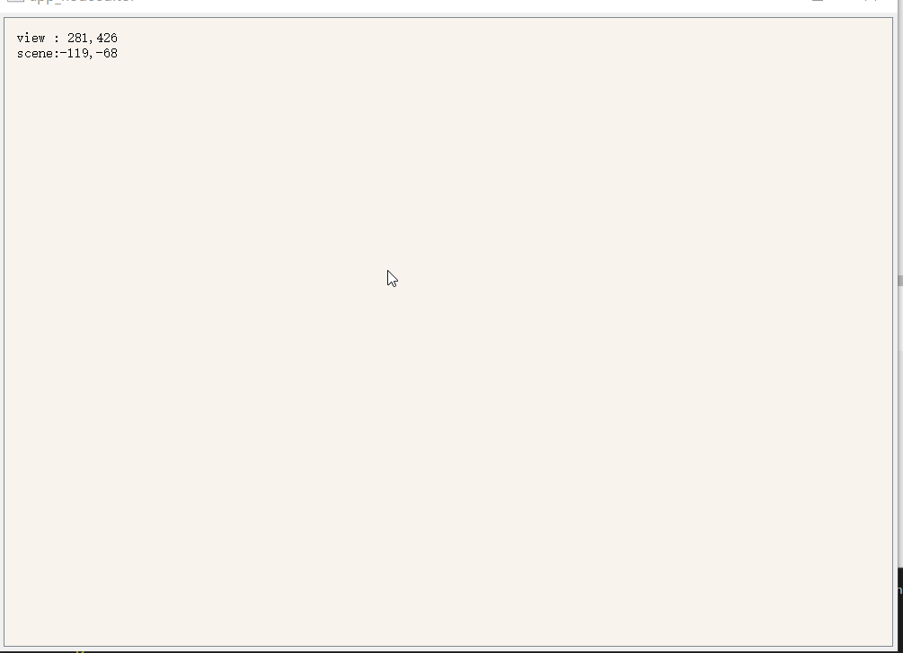
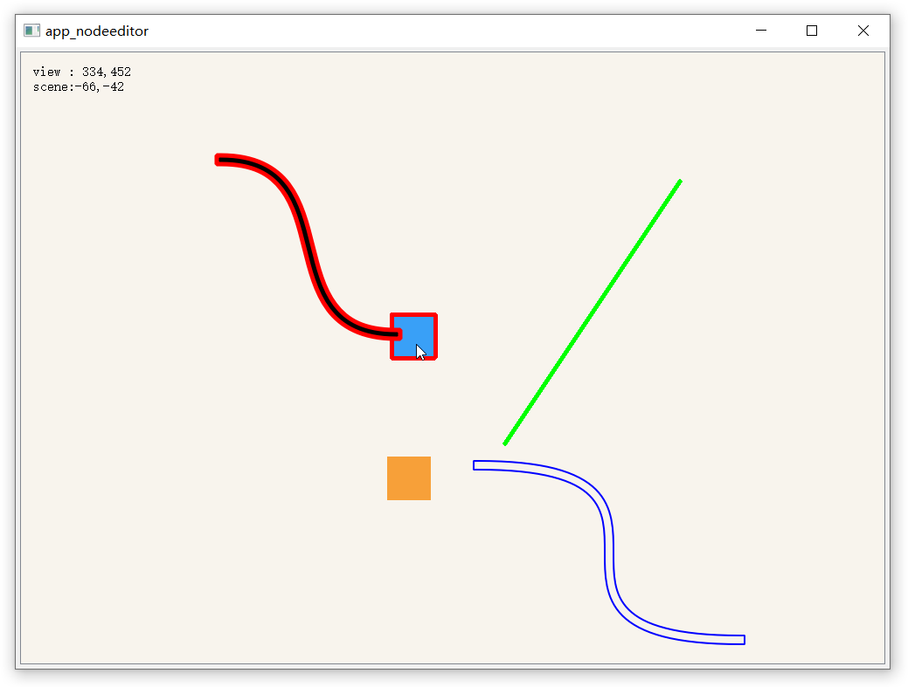

# QGraphics

## Scene, View, Item的联系

qgraphicsview, qgraphicsscene, qgraphicsitem 三者之间的关系

qgraphicsscene(场景)可以理解为一块画布，qgraphicsitem(图元)要绘制到“画布”中，但如果想要正常的看到scene里的内容，需要用一个qgraphicsview(视图)来监视scene。

view和scene的坐标系统也是不完全相同的，view的坐标系统与其他窗口类似，左上角为(0,0); scene则是中心点为(0,0)。 view和scene的坐标系统是可以通过函数直接转换的。

在初始定义时，需要先定义scene，再定义view（关键是建立好scene后再将view与scene绑定）

### test

实现一个支持鼠标追踪，实时显示坐标系的界面

实现鼠标追踪, 需要写一个自己的scene（继承）

```c++
/// my_scene.h
#ifndef MY_SCENE
#define MY_SCENE

#include <QGraphicsScene>
#include "item_test.h"

class my_scene : public QGraphicsScene
{
    Q_OBJECT
public:
    my_scene(QObject* parent = nullptr);
    ~my_scene();
signals:
    void sentScenePos(QPointF pos);
protected:
    // 左键：添加item  右键：移除item
    void mousePressEvent(QGraphicsSceneMouseEvent* event);
    void mouseMoveEvent(QGraphicsSceneMouseEvent* event);
    // Backspace键移除item
    void keyPressEvent(QKeyEvent* event);
};
#endif // !MY_SCENE
```

```c++
/// my_scene.cpp
#include "my_scene.h"
#include <qevent.h>
#include <qgraphicssceneevent.h>
#include <qdebug.h>

nodeeditor_scene::nodeeditor_scene(QObject* parent)
    : QGraphicsScene(parent){}

nodeeditor_scene::~nodeeditor_scene(){}

void nodeeditor_scene::mousePressEvent(QGraphicsSceneMouseEvent* event)
{
        QGraphicsScene::mousePressEvent(event);
    emit sentScenePos(event->scenePos());
}

void nodeeditor_scene::mouseMoveEvent(QGraphicsSceneMouseEvent* event)
{
    QGraphicsScene::mouseMoveEvent(event);
    emit sentScenePos(event->scenePos());
    
}

void nodeeditor_scene::keyPressEvent(QKeyEvent* event) {
    if (event->key() == Qt::Key_Backspace) {
        while (!selectedItems().isEmpty()) 
            removeItem(selectedItems().front());
    }
    else {
        QGraphicsScene::keyPressEvent(event);
    }
}
```

创建好自定义的scene后，在widget中添加scene等控件

```c++
/// mainwindow.h
#ifndef MAINWINDOW_H
#define MAINWINDOW_H

#include <qmainwindow.h>
#include <qwidget.h>
#include <qlabel.h>
#include <qgraphicsview.h>
#include <qgraphicsitem.h>
#include <qgraphicsscene.h>
#include "my_scene.h"

class mainwindow : public QMainWindow
{
    Q_OBJECT
public:
    mainwindow(QWidget* parent = nullptr);
    ~mainwindow();

    QWidget* central_widget;
    QGraphicsView* view;
    my_scene* scene;
    QGridLayout* gridlayout;
    QLabel* label_pos;

};
#endif // !MAINWINDOW_H
```

```c++
#include "mainwindow.h"

#include <qfiledialog.h>
#include <iostream>
#include <qstring.h>

#include <qevent.h>
#include <qdebug.h>

mainwindow::mainwindow(QWidget* parent):
    QMainWindow(parent)
{
    this->setMinimumSize(1000, 700);
    /// 定义scene尺寸
    scene = new nodeeditor_scene(this);
    scene->setSceneRect(-400, -400, 800, 700);
    /// mainwindow中需要设置一个central_widget
    central_widget = new QWidget(this);
    central_widget->setMouseTracking(true);

    label_pos = new QLabel(this);

    label_pos->setGeometry(20, 20, 200, 100);
    label_pos->setAlignment(Qt::AlignLeft | Qt::AlignTop);
    label_pos->setText(tr("pos"));

    view = new QGraphicsView(scene, this);
    view->setMouseTracking(true);

    /// scene中发出scene坐标后, 在该lambda函数中转换到view坐标系中, 打印到label中显示
    connect(scene, &nodeeditor_scene::sentScenePos, this, [=](QPointF pos) {
        auto view_pos = view->mapFromScene(pos);
            label_pos->setText(tr("view : %1\nscene:%2")
                .arg(QString("%1,%2").arg(view_pos.y()).arg(view_pos.x()))
                .arg(QString("%1,%2").arg(pos.y()).arg(pos.x()))
            );
        });

    gridlayout = new QGridLayout(central_widget);
    gridlayout->setSpacing(2);
    gridlayout->setContentsMargins(5, 5, 5, 5);
    gridlayout->addWidget(view);

    view->show();

}

mainwindow::~mainwindow()
{}
```

最后在主函数中启动mainwindow, 即可。

```c++
/// main.cpp
#include <qapplication.h>
#include "mainwindows.h"

int main(int argc, char* argv[])
{
    QApplication a(argc,argv);

    mainwindow m;
    m.show();

    return a.exec();
}

```



## item

场景中的各种图像都是有item组成的，我了解的也不多，但有一点点自己的理解。(先欠着吧)

### 基本属性

对于自定义的item来说，我认为QPen, QBrush是关键。

- pen
- brush
- collding

QPen负责描绘外侧轮廓，QBrush负责填充item内部颜色，collding用于碰撞检测，当自定义不规则图形时需要重写`shape()`函数，并在重写`boundingRect`函数时，返回`shape().boundingRect()`,可以表示图像最真实的形状。

自定义的item（基类是QGraphicsItem）是没有默认的pen和brush的，需要在类中自己定义，并且在paint函数中为painter加载pen和brush进行绘制。（详细的paint函数会在后续的示例代码中进行说明）

由于QGraphicsItem并非继承自QObject, 如果想要使自定义的Item带有信号槽功能，可以通过多重继承的方式正常使用信号槽功能。

```c++
class my_item : public QObject, public QGraphicsItem
{
    Q_OBJECT
    ///...
}
```

### 常用事件

鼠标拖拽事件:

- mousePressEvent
- mouseMoveEvent
- mouseReleaseEvent

鼠标悬浮事件:

- hoverEnterEvent
- hoverMoveEvent(不常用)
- hoverLeaveEvent

### test-lineItem(mouseMoveEvent)

再实现一个可拖拽的, 支持碰撞检测的直线类（基于LineItem）

### test-rectItem(hover + move)

再实现一个可拖拽，并且添加了悬停事件的 矩形item

### test-item bezier-curve

再基于Item实现一个支持拖拽、支持碰撞检测的cubic贝塞尔曲线。

自建的item，尤其是遇到不规则图像时，需要重构boundingRect(), shape(), itemChanged(), paint()

### ViewportUpdateMode

自定义paint后，拖拽item会出现拖影问题，解决方法是设置view的更新方法

`view->setViewportUpdateMode(QGraphicsView::FullViewportUpdate);`

### stroker

还要说一说类似于缓冲区效果的stroker

### test-



窗口内包含内容：

1. 多种可拖动的item组件
2. 具有鼠标悬停效果的矩形块rectItem
3. 有Pen但没有Brush的曲线
4. 多种图像的检测碰撞（红框表示有存在碰撞）
5. 自定义的贝赛尔曲线，支持拖拽和碰撞检测
