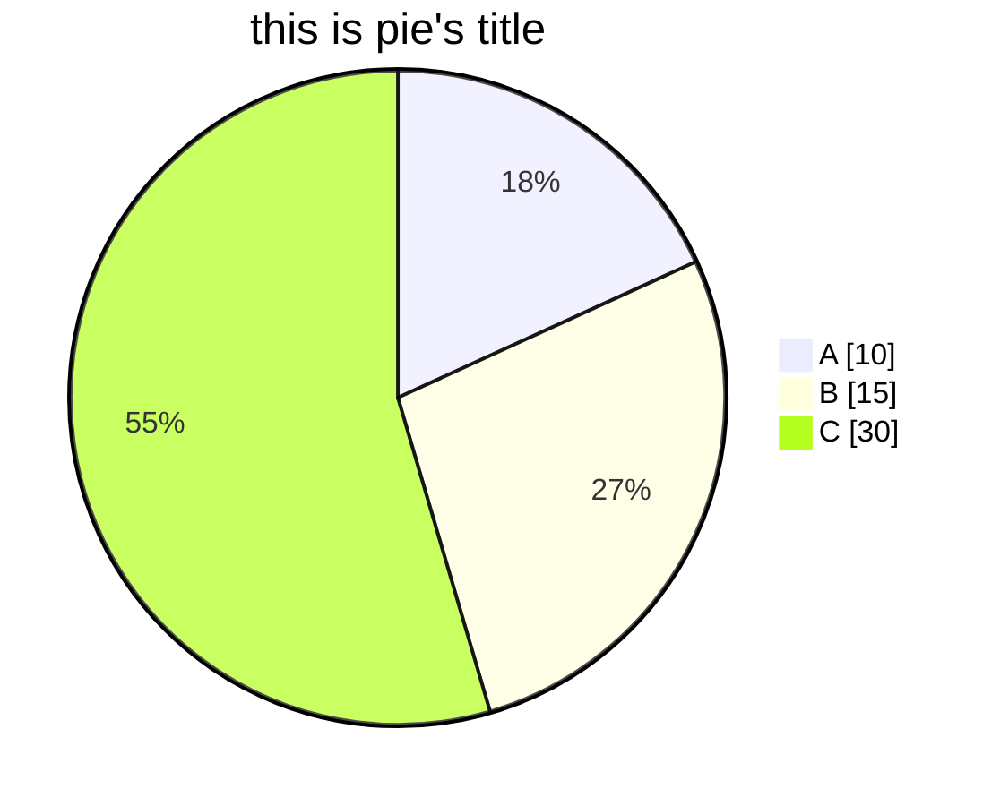

# markdown Diagram Syntax 图表语法

markdown可以绘制的图表有很多种，

包括：

- Flowchart流程图
- Sequence Diagram顺序图
- Class Diagram类图
- State Diagram状态图
- Entity Relationship Diagram实体关系图
- User Journey Diagram用户旅程图
- Gantt甘特图
- Pie Chart饼图
- Requirement Diagram需求图
- Gitgraph Diagram Git分支图

代码参考地址：https://mermaid-js.github.io/mermaid/#/

## Git-graph Diagram

### Syntax

> commit [id: "xxx"] [tag: "xxx"]     当前分支向前推送一个节点，添加id后可以修改界面名称（typora中无法实现id ），添加tag后可以在节点上方显示标签
>
> branch     创建一个新分支
> checkout：转换分支
> merge    与一个现有分支合并

**\*gitGraph示例在vscode-markdown中无法显示\***

```markdown
gitGraph:
commit
branch b2
checkout b2
commit
checkout master
commit
merge b2
```

## pie Diagram

### syntax

pie + showData (可选,是否在图例处显示真实值)
title 标题,可选
"label":value
...

### example


